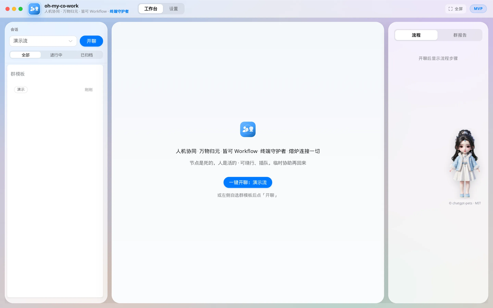
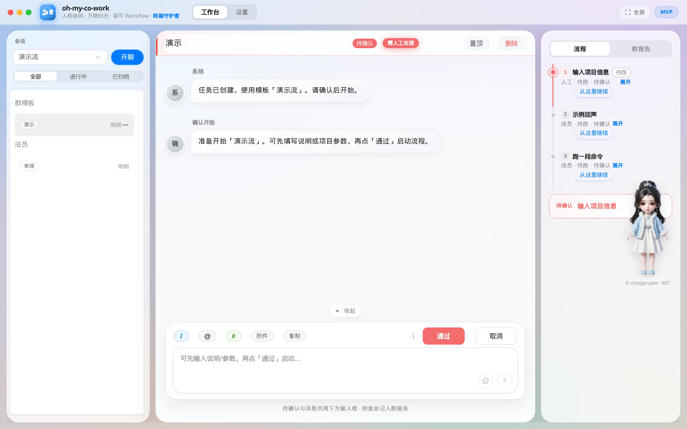
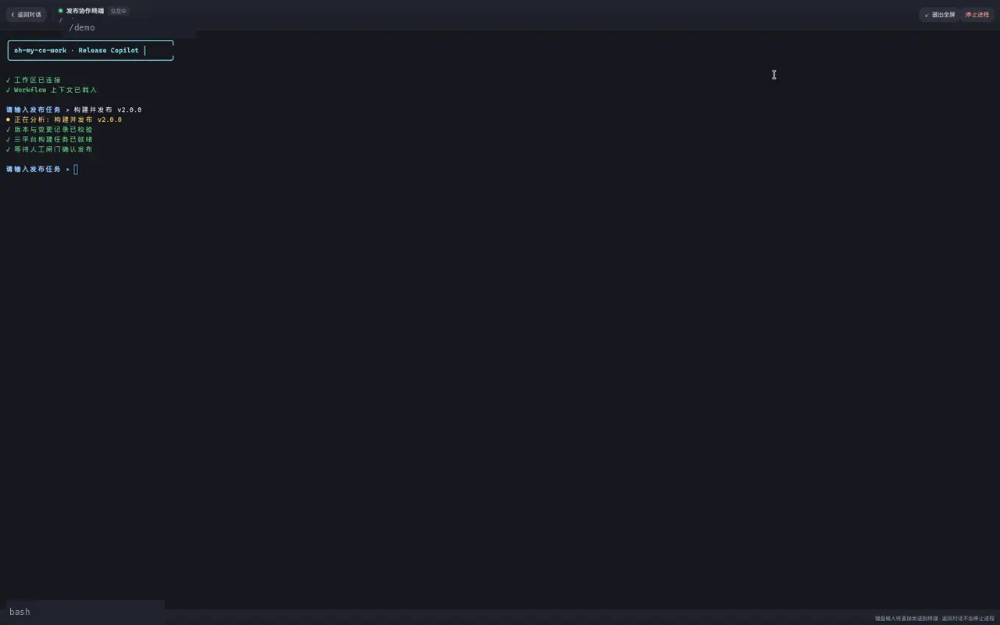
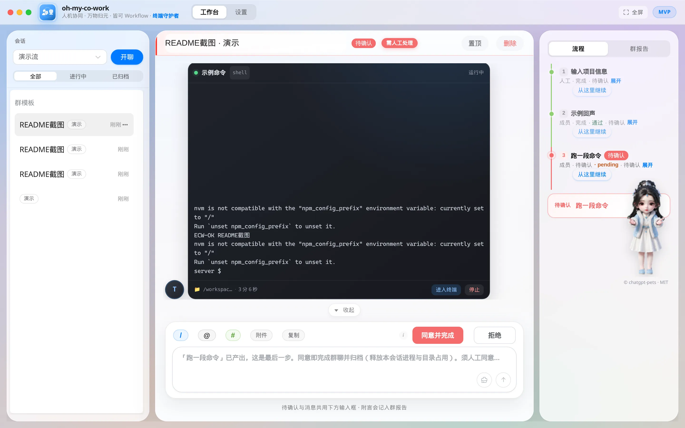
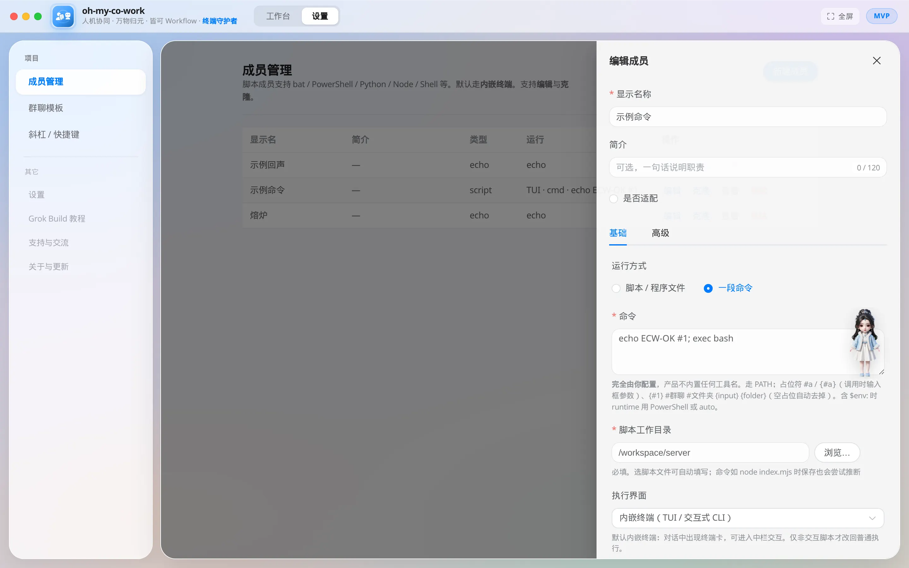
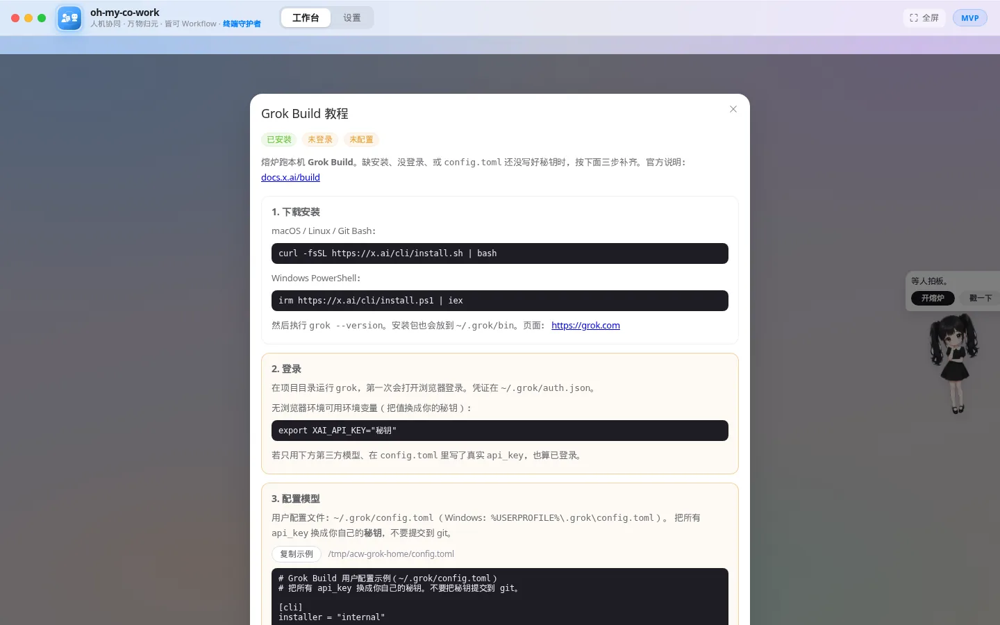
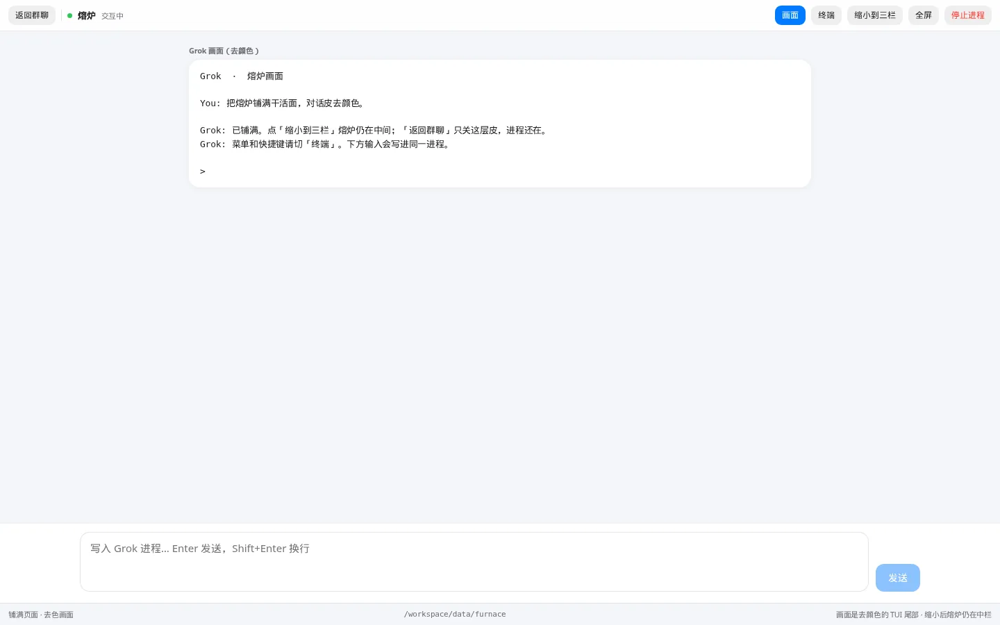

# oh-my-co-work

<p align="center">
  
</p>

<h3 align="center">人机协同 · 万物归元 · 皆可 Workflow · 终端守护者 · 熔炉连接一切</h3>

<p align="center">
  把人、Agent、脚本和 TUI 放进同一条 Workflow · 本地优先 · 人工闸门 · 内嵌真实终端
</p>

<p align="center">
  <a href="https://github.com/371684029/oh-my-co-work/stargazers"></a>
  
  
  = 18" />
  
  
</p>

> **节点是死的，人是活的。**
> Workflow 负责串起过程，人可以确认、拒绝、插队、绕行，也可以随时回来继续。

<p align="center">
  
</p>
<p align="center"><sub>桌宠立绘复制自 <a href="https://github.com/xiongxianzhu/chatgpt-pets">chatgpt-pets</a>（MIT © 2026 zhuxiongxian / 贡献者）：李慕婉 v2 图集，闲置呼吸、干活忙碌、等人询问；戳一下挥手，悬停会看向指针。</sub></p>


<p align="center"><sub>首页欢迎区 · 一键开聊演示流 · 右侧熔炉桌宠</sub></p>


<p align="center"><sub>三栏工作台：左会话、中对话与闸门、右流程轨</sub></p>

## 为什么做它

很多自动化工具仍然散落在 BAT、PowerShell、CLI、TUI 和不同 Agent 里：执行在终端，决策在聊天，进度靠人脑记，出错后很难复盘。

`oh-my-co-work` 把这些能力收进一个本地工作台：

- **像群聊一样协作**：一个工作流就是一个群聊，一个 Agent / 脚本就是一个成员。
- **关键决定交给人**：启动、参数、审核都可以设置人工闸门；群聊同意最后一步即完成并归档。
- **过程始终可见**：左边看会话，中间对话和执行，右边看流程与报告。
- **终端不再跳出去**：真实 PTY 内嵌 TUI。熔炉是本机官方 `grok` CLI 的宿主（不是自研 Chat API）：默认铺满 **GUI**，可切 **TUI**、可缩小回三栏。未装或未登录时点桌宠弹出 Grok Build 教程。
- **数据留在本机**：SQLite、Markdown 台账、附件和日志全部保存在本地。

## 使用场景

把日常流水线收成一条群聊：每一步是脚本、CLI、TUI 或 Agent 成员，关键处加人闸门。下面是几种常见配法，克隆群模板就能改。

**前端开发流**

切分支 → 起本地服务 → 脚本截 Figma / 对照稿 → 导出或拉取接口文档 → 氛围编程改页面 → 跑单测或 e2e → 提交并开/合 PR。本地服务和 TUI 走内嵌终端；合代码前用「同意」闸门。

**接口联调流**

拉最新 OpenAPI / 导出接口文档 → 起 mock 或连测试环境 → 跑集成脚本 → 人眼对一下响应 → 改客户端 → 提交。文档和命令都做成脚本成员，对不上就停在闸门。

**发版验收流**

切发布分支 → 跑测试与打包 → 预览包 / 打开产物 → 人验收截图或清单 → 打 tag、合并主干。打包用本机命令；「能不能发」留给最后一步人工同意。

**本机排障 + 熔炉**

复现命令进终端卡 → 需要改代码时点桌宠开熔炉（Grok）→ 人确认补丁 → 回归脚本 → 提交。熔炉和脚本同一条群聊里插队，不用另开窗口记进度。

## 2.0：真实 TUI，不是终端模拟



服务端使用 `node-pty`，前端使用 `xterm.js`。普通命令继续走原有 pipe 模式；交互式 CLI 可选择内嵌终端：

- 对话中出现实时终端卡，保留任务时序。
- 点击进入中栏终端工作区，右侧流程仍然可见。
- 支持键盘输入、窗口缩放、重新附着、停止进程与日志。
- 工作台和终端都可以独立全屏；终端另有 **满屏**，铺满页面、不调用系统全屏。
- 群聊走完默认归档并释放本会话进程；成员单聊不自动归档。其它占用可在设置里手动释放。
- **2.0.1**：本机 REST/WebSocket 使用随机访问令牌与回环 Origin 校验；停止、PID、长输出与断线重连已加固。

<table>
  <tr>
    <td width="50%">
      
      <p align="center"><b>对话、闸门与流程同屏</b></p>
    </td>
    <td width="50%">
      
      <p align="center"><b>脚本成员按需启用 TUI</b></p>
    </td>
  </tr>
</table>

## 3.7：熔炉干活面（3.x 封板）

点右侧桌宠「开熔炉」（或点两下头像）。本机已装且已登录 Grok 时直接铺满干活面；否则弹出 **Grok Build 教程**。

熔炉 **没有** 自研一套 Grok HTTP 客户端：工作台用 node-pty 托管本机官方 `grok` CLI。原理见 [熔炉 Grok 客户端](./docs/crucible-grok-client.md)。





- 桌宠用 [chatgpt-pets](https://github.com/xiongxianzhu/chatgpt-pets) **v2 图集**（李慕婉）：闲置 `idle` / 干活 `running` / 等人 `waiting`；戳一下播 `waving`；悬停看向指针。系统要求减少动效时停在 idle 第一帧。立绘从该 git 复制，**MIT © 2026 zhuxiongxian / chatgpt-pets 贡献者**（见 `web/src/assets/pets/LICENSE`）。
- 默认 **GUI**：欢迎卡说明能干啥；Grok 开口后只显示当前屏可读正文（去 TUI 框线和底栏）。底部输入、短指令芯片。附件落到熔炉 `inbox/`，发送时把相对路径写成一行写进同一进程（不是 Grok 原生传文件）。只留一张大卡通头像。
- 开炉写入 `data/furnace/AGENTS.md` 短规则 + `.grok/rules/session.md`（官方 CLI 没有能给交互式会话预填第一句话的参数，短启动词跟着规则一起写进去，由 grok 自己按目录发现）。长文在 `ACTIVE.md`，禁止复述。不写 `~/.grok/AGENTS.md`。
- **TUI**：原 Grok 终端。菜单和快捷键走这里。隐藏时不把 PTY 缩成几列。首次进入后切皮不拆终端。
- **缩小到三栏**：熔炉仍在中栏；**返回群聊**只关这层皮，进程还在。
- 设置「开熔炉默认」：铺满 GUI / 铺满 TUI。顶栏切换只改这一轮，不写回设置。

## 已实现

| 能力 | 说明 |
|------|------|
| 群聊式工作流 | 群模板、成员、会话、线性节点与实时状态 |
| 人工闸门 | 启动确认、参数输入、同意/拒绝；最后一步为「同意并完成」 |
| 熔炉 | 右侧桌宠；干活面 GUI/TUI 同一条 grok；**返回群聊只关皮**；顶栏「进程」里**关闭熔炉 / 新开熔炉**才清对话；短 AGENTS + rules 文件（不经命令行传 prompt）；GUI 附件写路径进同一进程 |
| 内嵌 TUI | PTY + xterm，支持输入、ANSI、resize、回放、停止、主题、粘贴确认、满屏与全屏 |
| 流程轨 | 当前节点、历史、克隆、跳过步骤折叠、从节点继续；适配角标 |
| 场外协助 | `@成员` 临时插队，完成后回到主流程；折叠态直接标出实际用了哪个成员 |
| 快捷输入 | `/` 指令、`@` 协助、`#` 会话参数与节点输出 |
| 群报告 | 自动汇总参数、节点输入输出和人工备注，落地 Markdown |
| 会话治理 | 置顶、改名、删除（顶栏删除会从列表拿掉并清终端行）、续跑；群聊完成即归档；设置里释放资源、备份、配额与脱敏 |
| JSONL Adapter | 可信侧通道提问转闸门、工具卡与结果写回；失败降级为真实终端 |
| 本地数据 | SQLite + Markdown + 本地附件和日志 |

## 快速开始

### 直接使用运行包

在 [`packages/`](./packages/) 或 [latest release](https://github.com/371684029/oh-my-co-work/releases/tag/latest) 下载对应平台压缩包：

```text
Windows  → 解压后双击 start.bat
macOS    → 解压后运行 ./start.sh
Linux    → 解压后运行 ./start.sh
```

运行包已包含依赖，通常不需要再次执行 `npm install`；本机仍需 Node.js 18+。桌宠图集打在前端里：要看 **chatgpt-pets 李慕婉**，请重新下载 zip 解压覆盖，不要沿用旧文件夹。latest 发布前会强制校验 Windows / macOS / Linux 三包来自同一源码提交且都含当前图集；包内 `BUILD_INFO.json` 可用于排障。

### 从源码启动

```bash
git clone https://github.com/371684029/oh-my-co-work.git
cd oh-my-co-work
npm install

# 终端 1：API / Workflow 引擎
npm run dev:server

# 终端 2：Vue 工作台
npm run dev:web
```

也可以一键启动（检查依赖、构建前端、起服务并打开浏览器）：

```bash
node start.mjs
# Windows 也可双击 start.bat；macOS / Linux：./start.sh
```

打开 <http://127.0.0.1:5173>，选择内置的「演示流」并点击开聊。工作台会通过 `/api/bootstrap` 领取本机令牌；`/api/health` 无需令牌，其余 `/api` 与 WebSocket 需要令牌。请用 `127.0.0.1`，少用 `localhost`。

脚本成员默认使用内嵌终端。仅非交互脚本才在设置里改回「普通执行」。

### 配置一个内嵌 TUI 成员

在 **设置 → 成员管理** 中选择“内嵌终端”，或直接使用以下配置：

```json
{
  "kind": "script",
  "script": {
    "mode": "command",
    "command": "your-cli",
    "scriptWorkDir": "/your/workspace",
    "executionMode": "terminal"
  }
}
```

未设置 `executionMode` 时默认内嵌终端；只有显式选择普通执行才会走原来的 pipe。

## 技术栈

```text
Vue 3 + Element Plus + Element-Plus-X
                  │ WebSocket
Node.js + Express + Workflow Engine
                  │
        node-pty / ConPTY / PTY
                  │
      BAT · PowerShell · CLI · TUI

SQLite ── 调度真相
Markdown ── 可读台账
Local Files ── 附件与日志
```

这是一个 npm workspaces 项目：

```text
web/       Vue 工作台与 xterm 终端
server/    API、Workflow 引擎、PTY 与进程治理
shared/    状态、参数和格式化约定
docs/      产品、架构、存储与实施文档
packages/  可直接运行的三平台压缩包
```

## 文档

| 文档 | 内容 |
|------|------|
| [2.x TUI 设计](./docs/tui-2x.md) | 产品形态、PTY 架构、协议、安全与平台兼容 |
| [2.x 实施计划](./docs/tui-2x-plan.md) | 2.0～2.3 阶段、测试、风险与完成定义 |
| [3.x 熔炉设计](./docs/crucible-3x.md) | Grok Agent + 提示词适配；加人改代码 / 加适配节点；桌面亦名熔炉 |
| [3.x 熔炉计划](./docs/crucible-3x-plan.md) | 3.0～3.7 阶段与完成定义 |
| [3.5 熔炉 GUI / TUI](./docs/crucible-3.5.md) | 铺满干活面、缩小回三栏、GUI 与 TUI 同一进程 |
| [3.7 熔炉封板](./docs/crucible-3.7.md) | 3.x 最终封板：chatgpt-pets 桌宠图集、头像、GUI 附件、PTY 宿主 |
| [熔炉 GUI 可读正文](./docs/crucible-gui-plain.md) | GUI 去 TUI 框线/底栏，只留能读的字 |
| [3.8 重构与加固计划](./docs/refactor-3.8-plan.md) | 引擎拆分、工作台拆分、ESLint 与令牌收紧（已实施） |
| [自测体系](./docs/selftest.md) | 测什么、怎么跑、表征测试/依赖注入/轮询等待三套路、发布闸门 |
| [4.x 协同文档中心计划](./docs/docs-4x-plan.md) | 聚合群报告/节点台账，左菜单右渲染，公告可编辑，链接可点（4.0.0 已实施） |
| [熔炉 Grok 客户端原理](./docs/crucible-grok-client.md) | 不调 Chat API；PTY 里跑官方 grok CLI |
| [脚本接入指南](./docs/script-guide.md) | BAT / PowerShell / CLI、参数、cwd 与终端模式 |
| [数据存储](./docs/data-storage.md) | SQLite、Markdown、附件、日志与备份 |
| [技术设计](./docs/technical-design.md) | Workflow、会话、节点、闸门与扩展设计 |
| [演示指南](./docs/demo.md) | 从启动到跑通演示流 |

## 路线图

- [x] 1.x：群聊工作台、流程引擎、闸门、归档与续跑
- [x] 2.0：真实 PTY、终端卡、中栏 TUI 工作区与全屏
- [x] 2.0.1：本机令牌与 Origin 防护、PID/长输出/重连修复
- [x] 2.2：常驻交互终端、start.bat 修复、终端卡与闸门打磨
- [x] 2.2.1：内嵌终端默认常驻、非 Windows 运行时自动、bootstrap 要 Origin
- [x] 2.3.0 最终封板：设置释放资源、去掉超时/归档闸门、终端守护者
- [x] 2.4.0 最终封板：终端偏好、配额、日志脱敏、重连缺口提示、JSONL Adapter 提问转闸门
- [x] 2.5.0 最终封板：首页「皆可 Workflow」后加重标识终端守护者
- [x] 2.6.0 最终封板：终端满屏（铺满 HTML 页面）与全屏并存
- [x] 3.3.0：熔炉桌宠、适配、工作流 prompt、Grok Build 教程；群聊完成即归档
- [x] 3.5.0：熔炉铺满 GUI（可缩小回三栏、可切 TUI）
- [x] 3.7.0 最终封板：chatgpt-pets 桌宠图集（李慕婉）、干活面头像、GUI 可读正文与短合同开炉、GUI 附件（路径写入 PTY）、Grok 原理文档
- [x] 3.7.1：熔炉桌宠/头像裁切修复、修复 Windows 内嵌终端「File not found」启动失败、收回适配筛选 Tab、三平台生产包发布流水线加固（打包即验 + CI 成本收紧）
- [x] 3.7.2：修复熔炉启动报错 `unexpected argument '--prompt'`——官方 grok CLI 没有 --prompt 参数，短启动词改经 AGENTS.md/rules 文件传，不再走命令行
- [x] 3.7.3：临时协助节点折叠状态直接标出实际 @ 的成员，不用展开就知道用了哪个工具
- [x] 3.7.4：支持与交流补邮箱联系方式（371684029@qq.com）
- [x] 3.8.0：引擎拆分——engine.js 模块化（store/offsite/archive/adapterEvents/advance/sessionLifecycle/gates/mentions/userInput，单向依赖无环），gate 与 advance 补 14 个直接单测
- [x] 3.8.1：工作台拆分——Workbench.vue 799 行布局壳、三栏组件化（SessionRail/FlowRail/ComposerPanel）、终端状态收敛进 composables、复制逻辑单一来源（terminalStatus/pagefill/localUploads）
- [x] 3.8.2：工程加固——ESLint 进 CI（0 error）、REST 收紧 `?token=`（WS 例外）、web 纯逻辑测试 13 例；浏览器人工冒烟与三平台打包交由后续流水线补验
- [x] 4.0.0：协同文档中心——本地聚合群报告/节点台账，新标签打开独立页面（左菜单右内容），默认群模板排序可切时间排序，群公告 MD 可编辑，超链/文档互链/本地文件夹链接可点
- [x] 4.1.0：文档中心增强——全文搜索、节点文档徽标、打包本群全部 MD 导出
- [x] 4.2.0：发布更新与本地历史保留——检查更新（手动触发）、更新面板、更新前一键备份、备份恢复、schema 迁移链；更新动作永不触碰数据目录
- [ ] 后续：托盘独立窗、多终端标签治理、更多 CLI Adapter
- [ ] 桌面壳、托盘与系统通知

## 参与项目

欢迎提交 [Issue](https://github.com/371684029/oh-my-co-work/issues) 或 Pull Request：

1. 先描述使用场景和希望解决的问题。
2. 行为变化同步更新文档。
3. 新执行体优先保持可插拔，不把具体工具写死在 Workflow 内核。

技术交流也可到工作台 **设置 → 支持与交流**，邮箱 `371684029@qq.com`。

如果这个项目让你的脚本、Agent 或 TUI 更容易协作，欢迎点一个 **Star**。
它会帮助更多正在解决同类问题的人看到这个项目。

## 点赞支持

完全自愿，不影响任何功能。若你愿意，期待一点点小惊喜 ✨

| 微信 | 微信 | 支付宝 | 添加好友 |
|:---:|:---:|:---:|:---:|
|  |  |  |  |
