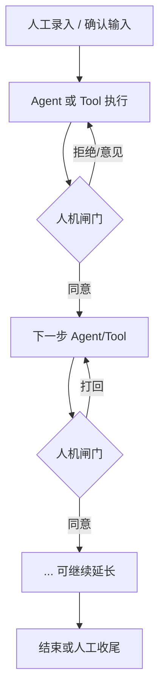

# oh-my-co-work 技术设计文档

| 属性 | 内容 |
|------|------|
| 项目名 | **oh-my-co-work** |
| 仓库 / 包名 | `oh-my-co-work` |
| 文档版本 | v3.8 |
| 状态 | **MVP 已实现可运行**；本文保留完整愿景与后置设计 |
| 更新日期 | 2026-07-16（UI 氛围 · 点赞支持 · 等人标红） |
| 上手 | 根目录 [README.md](../README.md) |
| MVP 对照 | [mvp.md](./mvp.md) |
| 2.x TUI | [tui-2x.md](./tui-2x.md) |
| 3.x 熔炉（规划） | [crucible-3x.md](./crucible-3x.md) |
| 工程清单 | [data-and-ops.md](./data-and-ops.md)（P0–P4） |
| 前端组件 | [frontend-components.md](./frontend-components.md) |
| 技术基线 | **双轨**：Web + **GUI（桌面壳）**；Vue3 + Element Plus + Plus-X；共用 Node.js 内核 |

**命名语义**：`element` 标明 Element Plus / Plus-X 技术基线；`co-work` 强调 **人机协同 · 协同办公**（人与智能体同台对话、闸门、工作流；办公协作感优先于纯 Agent 编排）。

### 阅读约定：内核 vs 举例

沟通中大量内容是 **举例说明平台长什么样**，不是已定业务范围。读本文时请区分：

| 层级 | 含义 | 文档中的表现 |
|------|------|----------------|
| **内核（当前共识）** | 平台要做成什么形态 | **网页 + GUI 双轨**、类微信三栏、克隆、归档/停止/重启、设置中心、闸门；**数据与工程按 P0–P4 清单落地**（[data-and-ops.md](./data-and-ops.md)） |
| **举例（未定稿）** | 帮助理解的场景、Agent、表单字段、本地脚本 | 一律标注「示例」；可整体替换，不构成交付承诺 |
| **待决** | 需要你后续拍板 | 见文末「开放问题」 |

**示例不等于需求**：需求交付链路、建分支、截图、启动项目、Grok/Cursor、某张表单字段、`ai/work/*` 脚本等，均为可选示例。最终首批场景与 Agent 清单以另行讨论为准。

---

## 1. 项目定位

### 1.0 宗旨与当前焦点（已决）

| 项 | 内容 |
|----|------|
| **宗旨** | **人机协同 · 万物归元 · 皆可 Workflow**；**节点是死的，人是活的**——流动的 Workflow，人可绕行、插队、场外办事再回来；看见流程、关键点闸门、任务可归档可续 |
| **产品形态** | 类微信三栏 + 设置中心；Web + GUI 双轨（长期）；主题 = Element-Plus-X 默认色 |
| **当前焦点** | **第一步只做 MVP** → 详见 **[mvp.md](./mvp.md)** |
| **执行纪律** | MVP 未验收前，不主动做 GUI 壳、真实业务 Agent 全家桶、断点续跑、P2+ 运维大项 |

### 1.1 一句话

**oh-my-co-work** 是一个 **群聊式多智能体协同平台**：

- 每个 **工作流 ≈ 一个群聊**（可新建、可配置）  
- 每个 **Agent / 工作脚本 ≈ 一个群成员**（可配置、可修改）  
- 运行时像在群里对话、过闸门、看进度  
- **额外能力进设置**；长期 **Web + GUI** 共用内核  

> 底层是工作流引擎 + 可插拔执行体。**完整愿景见后文；落地顺序以 mvp.md 为第一步。**

### 1.2 要解决的问题（平台层）

| 痛点 | 表现 |
|------|------|
| 能力碎片化 | 多个 Agent / 脚本 / CLI 各自为政，靠人脑串流程 |
| 状态不可见 | 不知道当前卡在哪一步、谁在等谁 |
| 人机协同弱 | 需要确认时只能停在终端或 IM，缺少结构化「同意/拒绝/改参数」 |
| 多 Agent 串场难 | 不同执行体输出格式不一，上下文难在步骤间复用 |
| 难复盘 | 一次任务的决策、消息、产物链断裂 |
| 进程断档 | 关窗口、换机器、过几天再回来，记不清做到哪、分支/路径是啥 |
| 配置散落 | 脚本路径、角色提示、群里有谁，改一处要翻代码 |
| 名称敏感 | 演示/录屏/协作时不想暴露真实成员名或内部群名 |

平台目标是做成 **「双轨 UI + 共用内核 + 群聊工作流 + 统一设置」** 的通用壳：

1. **Web 轨**：浏览器内群聊工作台、设置中心、闸门、可视化进度（完整体验）  
2. **GUI 轨**：桌面窗口内完整工作台（可托盘/通知；优先复用 Web 页面）  
3. **共用内核**：Session、工作流引擎、成员运行时、台账、设置数据 **只实现一份**  
4. **人机闸门与对话**：同意 / 拒绝 / 意见（两轨都要能完成关键操作）  
5. **产物与审计**（配置项在设置里；Web/GUI 设置同源（同一套页面））  

（具体痛点场景可以是研发交付，也可以是其它需要「多步 Agent + 人工把关」的流程——**领域待定**。）

### 1.3 非目标（当前阶段）

- 不做成万能 RPA / 全量 BPM 套件  
- 不在 v1 内自研大模型  
- 不默认替代某一家 IDE Agent 的全部能力；平台侧做 **编排与闸门**，外部能力通过 Adapter 接入  
- 不先做多人实时共编同一会话（可后续扩展）  
- 不先做复杂 BPMN 全量语义；优先 **线性 + 分支 + 人工节点** 的可落地子集  
- **不把某一业务示例写死成唯一产品方向**  
- **不做两套互不相干的业务逻辑**（Web / GUI 禁止各写各的引擎）  
- GUI **不另起一套业务 UI**（优先套壳复用 Web）；可增加托盘、通知、开机启动等桌面能力  

### 1.4 目标用户（暂定，可改）

- 需要把多步 AI / 自动化步骤串起来，并在关键点人工介入的人  
- 个人或小团队；单机优先（是否服务化以后再说）  
- 是否聚焦「研发交付」或其它垂直场景：**待决**  

---

## 2. 核心概念

### 2.0 产品隐喻：群聊 × 成员

| 用户话术 | 工程对象 | 说明 |
|----------|----------|------|
| **群聊** | Workflow 模板 + 一次 Session 运行 | 可新建、可配置「群里有谁、怎么接力」；运行起来像一个群的消息流 |
| **成员** | Agent / 工作脚本 / Tool 封装 | 可配置、可修改；进群后作为发言/执行主体 |
| **克隆成员** | 从已有成员复制出的独立副本 | **可无限克隆**；配置互不影响；见 §2.0.2 |
| **克隆群聊** | 从已有群模板复制出的独立副本 | **可无限克隆**；编排/成员引用可再改；见 §2.0.2 |
| **我（用户）** | Human 角色 | 永远在群里；闸门操作、发言、改参 |
| **系统** | system 消息 | 入群、节点切换、错误等 |
| **设置（Settings）** | 统一后台 | 成员、群模板（含克隆）、掩码、台账、控制台、支持与交流、通用等 |
| **掩码** | display mask | 展示层替换群名/成员显示名，**不改真实 id 与执行配置** |

```
主导航：工作台 | 设置
设置
  ├── 成员库 Members[]          ← 空白新建（一次）/ **克隆新建**；**不支持事后编辑**
  ├── 群聊模板 Groups[]         ← 同上
  ├── 掩码
  ├── 进程守护 / 台账
  ├── 控制台
  ├── 支持与交流
  └── 通用
        │
        ▼ 从工作台左栏开聊
Session（一次群聊实例）
  └── WorkflowInstance
        └── NodeInstance → MemberRun / HumanGate / Artifacts
```

| 概念 | 说明 |
|------|------|
| **Member（成员）** | 可配置执行体；可选 **工作文件夹**（脚本 cwd 优先）；script 可为 bat 文件或一段命令 |
| **Group / 群聊模板** | 工作流模板；可选 **工作文件夹**（步骤执行时回落 cwd）；节点编排与闸门 |
| **工作文件夹 workFolder** | 成员/群可选默认路径；**Session 级**还可在发需求时由模型推断/写入（见 §2.0.3） |
| **改动范围 scope** | 本任务允许/实际触碰的目录与文件集合；终检时对比并 **暴露越界改动** |
| **Clone（克隆）** | **主新建路径**：深拷贝成员/群模板；克隆时表单可改配置，**保存后不可再编辑**；可无限克隆 |
| **Session / 任务（聊天）** | 一局运行；**聊天名称可编辑**；**支持删除**；完成后默认归档 |
| **Archive（归档）** | **只释放资源**；同一 Session 可无限归档/解档；再发仍在本会话；**绝不因此新建群聊**；续跑=本会话追加克隆节点。见 [mvp.md §1.0](./mvp.md) |
| **HumanGate** | 群内结构化审核：**同意 / 拒绝 / 意见 / 改参数** |
| **Message** | 群消息：user / member / system / gate_action … |
| **Artifact** | 产物引用 |
| **Mask（掩码）** | 配置项 Switch；开则 UI 用掩码名展示群/成员，关则显示真实配置名 |

### 2.0.3 工作文件夹：发需求推断 + 终检暴露改动（内核）

**诉求**：

1. 用户在 **群聊中发布需求** 时，就把「改哪个/哪些项目目录」说清楚——可由 **大模型根据需求判断并写入本任务的工作文件夹**（可人改）。  
2. 流程 **最后一步做校验与总结** 时，必须核对：实际改动是否落在约定文件夹内；若 **多改了、改错仓、改到界外**，要 **明确暴露**，不能改错了还不知道。

#### 生命周期中的文件夹

```
用户发需求（中栏首条/人工节点）
    →（可选 LLM）解析需求 → 建议 workFolders[] / 主 workFolder
    → 人机闸门：确认或改文件夹（可跳过自动确认策略）
    → 任务 context 写入 session.workFolders（本局生效）
    → 后续 script/llm 成员优先在这些目录下跑
    → …
    → 终检节点：收集实际改动（git status / 文件快照 diff）
    → 对比「约定范围 vs 实际改动」
    → 总结消息 + 闸门：正常 / 警告越界 / 阻断（可配）
    → 归档
```

#### 1）发布需求时：模型判断文件夹

| 项 | 约定 |
|----|------|
| 触发 | 用户在群里提交需求描述（human 节点或任务首条消息） |
| 输入 | 需求文本 + 可选「已知仓库列表」（配置里的路径字典，便于模型对齐真实盘符） |
| 输出 | `session.workFolders: string[]`（可多个仓）、`primaryWorkFolder`、`reason`（为何选这些） |
| 展示 | 中栏系统/成员气泡：「本任务拟在以下目录工作：…」+ **确认闸门**（同意/改参数） |
| 与配置关系 | Session 级覆盖 **仅本局**；不自动改掉群/成员上的默认 workFolder（除非用户点「写回群默认」二期） |
| 无 LLM 时 | 人工在表单里填工作文件夹，或沿用群默认；MVP 可先做人填 + 终检 |

**cwd 完整优先级**（更新）：

1. `script.cwd`（单次配置）  
2. `member.workFolder`  
3. **`session.primaryWorkFolder` / session.workFolders[0]**（本局由需求推断）  
4. `group.workFolder`  
5. 进程默认  

多仓任务：成员可声明 `workFolderKey` 或由节点 input 指定用 `workFolders[i]`。

#### 2）最后一步：校验 + 总结 + 暴露多改

| 项 | 约定 |
|----|------|
| 节点类型 | 建议固定为流程末段：`scope_check` + `summary`（可合并为一个「校验与总结」成员/节点） |
| **约定范围** | `session.workFolders`（发需求时锁定的目录列表） |
| **实际改动** | 优先对各 workFolder 跑 `git status` / `git diff --stat`；无 git 则文件 mtime/快照 diff（实现可选） |
| **分类结果** | ① 范围内改动 ② **范围外改动（越界）** ③ 约定目录完全无改动（可能没干活或路径错） |
| **必须暴露** | 中栏用醒目卡片列出：越界路径列表、各目录变更摘要；**不能只写一句「完成」** |
| **闸门** | 有越界时默认 **waiting_human**，用户同意才归档；无越界可自动过或轻提示 |
| **台账** | 进度/总结 MD 写入「约定目录 / 实际改动 / 越界列表」 |

**暴露卡片示意（中栏）**

```
【范围校验】
约定工作目录：
  ✓ D:\product\new-ht-admin
  ✓ D:\product\yzgd-admin-ecommerce

范围内变更： 12 files（可展开）
⚠ 范围外变更（请确认是否误改）：
  • D:\product\other-repo\src\foo.ts
  • D:\temp\xxx

总结：…
[ 仅范围内，继续归档 ]  [ 有越界，我已知晓仍归档 ]  [ 打回处理 ]
```

#### 3）产品原则

- **宁可吵一下，不可默默改错仓。**  
- 越界默认 **可见 + 需人确认**，不要静默成功。  
- 发需求推断允许错，靠确认闸门纠；终检负责兜底。

#### 实现分期

| 阶段 | 做啥 |
|------|------|
| **MVP** | 群/成员 workFolder 表单；Session 可手工带文件夹；终检可用 **script 成员**跑 `git status` + 人工看输出（或简单路径前缀校验 stub） |
| **增强** | 发需求 LLM 推断文件夹 + 确认闸门；终检结构化 diff 卡片 + 越界阻断策略 |
| **完善** | 多仓映射表、写回群默认、与开发 Agent 的 allowlist 联动 |

### 2.0.4 聊天（Session）名称与删除（内核）

与「成员/群模板不可编辑」区分：**工作台里的聊天是任务实例，名称可改、可删。**

| 能力 | 说明 |
|------|------|
| **聊天名字可编辑** | 左栏会话标题、中栏顶栏标题；双击或「重命名」；改的是 `session.title`，**不改**群模板名 |
| **聊天可删除** | 删除 Session（进行中或已归档均可）；二次确认；删消息/节点实例/产物引用；**不删**群模板与成员 |
| **删除 vs 归档** | 归档=结束保留历史；删除=去掉这条聊天记录 |
| **置顶** | 仍针对会话列表项；删除后置顶解除 |

### 2.0.1 任务完成、停止与归档（内核）

**诉求**：一次任务要有清晰边界——**归档释放资源**；之后仍在**同一会话**解档续聊或「克隆并从此开始」追加节点，并可再次归档。新会话只通过左栏「开聊」。

#### 何时结束任务（都会进入归档）

| 类型 | 触发 | 说明 |
|------|------|------|
| **被动完成** | 工作流走到 `end` / 成功终态 | **必须默认自动归档** |
| **主动停止** | 用户点「归档 / 停止任务」 | 手动结束，立即归档 |
| **被动停止** | 失败、超时、引擎取消、异常中止等 | 默认也归档（`archive_reason=failed|cancelled`），便于列表干净 |

> 「暂停」≠ 停止：暂停可继续同一任务；**归档 = 释放资源**，会话仍在，可解档续聊或追加节点重开。

#### 生命周期

```
创建任务 (active)
    → 运行 / 闸门 / 暂停（仍属同一任务）…
    → 完成 / 停止 / 失败 ──► 归档 (archived)  // 只释资源

archived 后（同一 Session，可无限次）：
    A. 再发消息           → 解档，仍在本会话（绝不新开群聊）
    B. 「克隆并从此开始」 → 本会话线性追加克隆节点并开跑
    C. 再次归档           → 再释资源；可循环
    D. 左栏「开聊」       → 才是新建会话（与归档无关）
```

#### 归档规则（已决 · 与 mvp.md §1.0 一致）

| 规则 | 说明 |
|------|------|
| **归档只释资源** | 尽量结束进程并放开目录；不是结束会话、不是新开群聊 |
| **再发仍在本会话** | 解档续聊；不新建 Session / 群模板 |
| **可无限归档** | 同一会话可反复归档 / 解档 |
| **续跑追加节点** | 「克隆并从此开始」在本会话线性追加克隆节点，历史保留 |
| **新会话唯一入口** | 仅左栏「开聊」 |
| **列表** | 进行中 / 已归档可筛选；已归档仍可打开操作 |

#### 用户入口（归档）

| 入口 | 行为 |
|------|------|
| 流程到达终点 | 进入待确认归档 / 超时自动归档 |
| 顶栏「归档」 | 主动归档（释资源） |
| 左栏「已归档」 | 回看；可解档再发或「克隆并从此开始」 |

---

### 2.0.1.1 重启任务（简单版 · 内核）

**诉求**：任务完成一半就被停掉、或已归档后，还想 **接着干**——不是原地复活旧 Session，而是走一条 **明确的重启路径**。

**v1 刻意做简单**，不恢复节点级断点执行。

#### 前置条件（必须）

重启任务 **必须同时** 满足：

1. **克隆群聊**：基于原任务所用群模板（或用户指定的源群）执行一次 **克隆群聊**，得到 **新群模板**（独立 id）。  
2. **指定进程维护文档**：在进程守护台账中选中一条已有任务明细（`journals/tasks/...`），作为本次重启要续写的台账。

缺一不可；对话框校验不通过则不能创建重启 Session。

#### 简单版做什么 / 不做什么

| 做 | 不做（以后再说） |
|----|------------------|
| 克隆出新群模板并用于新 Session | 从失败节点精确断点续跑 |
| 新 Session **绑定** 指定 journal 路径 | 自动解析 MD 推算应跳到哪一节点 |
| 台账写入「重启自 sessionXxx / 于某时」一条进度日志 | 自动克隆成员、自动改分支名等 |
| 流程图仍从模板 **入口节点** 开始跑 | 复杂 diff 旧消息进新会话 |

> 续作进度主要靠 **人 + 进程守护 MD** 承接上下文；引擎侧从干净流程再走，避免半残状态机。

#### 交互（示意）

```
已归档任务页 / 历史详情
  → [重启任务]
  → 向导（简单两步）：
       1) 克隆群聊：展示源群名 → 确认克隆（可改新群显示名）
       2) 选择进程维护文档：下拉/文件树选 journals/tasks/<slug>/
  → 确认
  → 得到：新 Group 模板 + 新 Session(active) + journal 绑定
  → 进入工作台中栏，系统消息：「已从台账 xxx 重启；流程自起点开始」
```

#### 数据关系（示意）

```ts
// 新 Session 上
{
  status: 'active',
  groupId: '<clonedGroupId>',
  journalTaskId: '<selectedJournalSlug>',
  restartedFromSessionId: '<oldArchivedSessionId>',  // 可选血缘
  restartMode: 'simple'  // v1 固定
}
```

#### API（示意）

```
POST /api/sessions/:id/restart
body: {
  cloneGroup: true,                 // v1 必须 true
  newGroupTitle?: string,
  journalTaskId: string,            // 必填：进程维护文档
  // 以后：resumeFromNodeId 等
}
→ { newSessionId, newGroupId, journalTaskId }
```

实现顺序建议：内部先 `POST groups/:id/clone`，再 `POST sessions` 并挂 `journalTaskId`，写 journal 进度一行「重启」。

#### 与「归档后再发」的区别（已决）

| | 归档后再发消息 | 左栏「开聊」 |
|--|----------------|-------------|
| 结果 | **同一会话**解档续聊 | **新建**会话 |
| 流程轨 | 历史保留；续跑则追加克隆节点 | 新开一套节点 |
| 是否新建群模板 | 否 | 否（沿用所选模板） |
|--|-------------------|----------|
| 群模板 | 默认仍用原槽位/原模板 | **必须先克隆群聊** |
| 进程文档 | 新建或空台账 | **必须指定已有维护文档** |
| 用途 | 全新一件事 | 接着旧进度文档再开一局流程 |

### 2.0.2 克隆成员 / 克隆群聊（内核）

**诉求**：同一类能力要多开几份（例如多个「开发助手」、多条并行交付群模板），不必从零配置——**以现有成员/群为蓝本无限克隆**。

#### 规则

| 规则 | 说明 |
|------|------|
| **不支持事后编辑** | 成员、群模板保存后为 **只读**；要改配置 → **克隆新建** 再在创建表单里改 |
| **无限克隆** | 同一来源可反复克隆，无次数上限 |
| **独立实体** | 克隆体新 id；与源互不影响 |
| **深拷贝配置** | 成员 script/file/command、workFolder 等；群步骤、闸门、workFolder 等 |
| **克隆时表单** | 克隆向导里可改显示名、工作文件夹、命令等，**确认创建后锁定** |
| **默认命名** | `{原名} 副本` / `#2`；创建时改名 |
| **血缘** | `clonedFromId` + `cloneGeneration`；删源不级联删克隆体 |
| **群克隆与成员** | 默认只复制成员引用；可选一并克隆成员 |
| **vs 聊天** | 克隆的是 **模板**；聊天（Session）名称可改、可删，见 §2.0.4 |

#### 用户入口

| 位置 | 操作 |
|------|------|
| 设置 → 成员 | **新建**（空白表单一次）/ **克隆** / 只读详情 / 删除 |
| 设置 → 群模板 | **新建** / **克隆** / 只读详情 / 删除 |
| 无「编辑」按钮 | 详情页只读；文案：「如需修改请克隆」 |

#### 克隆结果（示意）

```
成员A
  ├─ clone → 成员A 副本
  ├─ clone → 成员A 副本 #2
  └─ clone → 成员A 副本 #3   … 可继续

群模板「需求交付」
  ├─ clone → 需求交付 副本
  └─ clone → 需求交付 副本 #2   … 可继续
```

### 2.1 节点类型（群内「谁出牌」）

| 类型 | 行为 | 群聊直觉 |
|------|------|----------|
| `agent` / `member` | 某成员执行并发言 | 成员在群里干活/说话 |
| `human` | 等人填表或发言 | @所有人 等你 |
| **`offsite`（场外协助）** | **额外节点**：按**当前时序游标**插入（开场 @ → 第一位；中途插在当前步前） | 干到一半点外卖、@人办事，再流回主线 |
| `gate` | 强制审核 | 管理员/你过审 |
| `condition` | 按结果走边 | 群公告分支 |
| `parallel` | 多成员并行 | v1 可后置 |
| `tool` | 无 LLM 脚本成员 | 「机器人」静默执行也可冒泡日志 |

> **节点是死的，人是活的。** 场外可扩展。重开=本会话追加克隆。**归档只释资源、可无限次；再发不新开群聊。**

### 2.2 节点生命周期

```
pending / waiting_human（产品文案统称「未执行」）
  → running → succeeded
            ↘ failed
            ↘ skipped
```

- `pending` / `waiting_human`：产品展示均为 **未执行**（归档后也可保留未执行节点）  
- `waiting_human`：右侧展示闸门 UI，工作流引擎挂起该路径  
- **归档**：作用是 **释放进程资源、避免溢出**；流程轨默认仍展示全部节点（含未执行）  
- 用户 **同意** → 沿 success 边前进；**拒绝** → 失败边或回退边；**意见** → 写入上下文后可选重跑当前节点  

---

## 3. 产品形态与交互

### 3.0 交互双轨：Web + GUI

**已决**：同时提供 **网页（Web）** 与 **桌面 GUI**，双轨并行，不是二选一。  
（曾误写为 TUI，已更正为 **GUI = 图形桌面客户端**。）

```
                    ┌─────────────────┐
                    │  core / server  │  引擎·成员·设置·台账·WS/API
                    └────────┬────────┘
               ┌─────────────┴─────────────┐
               ▼                           ▼
        ┌─────────────┐             ┌─────────────┐
        │  Web        │             │  GUI        │
        │  浏览器打开   │             │  桌面窗口壳   │
        └─────────────┘             └──────┬──────┘
               ▲                           │ 加载同一套 web 页面
               └───────── web/ 前端 ────────┘
```

| 维度 | Web | GUI |
|------|-----|-----|
| 定位 | 浏览器访问本机服务 | 安装包 / 双击启动的桌面应用 |
| 适合 | 开发调试、不装客户端、演示分享链接（本机） | 日常工具感、托盘、系统通知、开机自启、系统文件对话框 |
| 技术（规划） | Vue3 + Element Plus + Plus-X + xterm.js | **Tauri 2** 或 **Electron**（待决）+ **复用 web 构建产物** |
| 协议 | HTTP + WebSocket → 同一 server | 同左；GUI 启动时可 **自动拉起/附着** 本地 server |
| UI 代码 | `web/` | **默认不重写 UI**，壳内嵌/加载 web |
| 设置 / 群聊 | 全量 | 与 Web **同一套页面** |
| 桌面增强 | — | 托盘、通知、窗口状态、可选深度系统集成 |

#### 能力矩阵（内核要求）

| 能力 | Web | GUI | 说明 |
|------|-----|-----|------|
| 群列表 / 开聊 | 必做 | 必做 | 同 UI |
| 群消息 + 闸门 + 进度 | 必做 | 必做 | 同 UI |
| 设置中心全量 | 必做 | 必做 | 同 UI |
| 内嵌控制台 | 必做 | 必做 | 同 xterm；GUI 本机 PTY 更自然 |
| 托盘 / 系统通知 | 不做 | 宜做 | 仅 GUI |
| 自动启动本地 server | 手动或脚本 | 宜做 | GUI 启动时 |
| 安装包分发 | 可选 | 必做（打包） | |

#### 启动方式（示意）

```bash
# 起内核
ecw serve

# Web：浏览器打开 http://localhost:<port>
# GUI：安装后双击，或
ecw desktop        # 开发模式启动桌面壳
```

Web 与 GUI 可同时使用（例如一边浏览器调试、一边桌面日常用），连同一 server 时状态共享。

#### 设计约束

1. **领域逻辑只在 core/server**；Web/GUI 均为 thin client。  
2. **GUI 优先套壳复用 `web/`**，禁止维护第二套业务界面（除非未来有强原生需求）。  
3. 事件模型共用：`message` / `node.status` / `gate.request` / `console.chunk`。  
4. 展示名/掩码解析用 `shared/`，避免分叉。  
5. GUI 负责进程生命周期（server 子进程、优雅退出），Web 轨可假设用户已 `ecw serve`。

---

### 3.0.1 信息架构：工作台 + 统一设置

**原则：额外功能不单独占主导航，一律进「设置」。**（Web 与 GUI 同一导航结构。）

| 区域 | 用户心智 | 能力 |
|------|----------|------|
| **工作台（类微信）** | 干活 | **三栏**：最左会话列表 · 中栏对话/人机协同 · 最右流程流转图 |
| **设置** | 管平台 | 成员、群模板、掩码、进程守护、控制台、支持与交流、通用等 |

```
顶栏：[工作台] [设置]     当前会话…    [暂停/继续] [掩码]
```

设置内侧栏：成员管理 · 群聊模板 · 掩码 · 进程守护 · 控制台 · **快捷键** · 支持与交流 · 通用

| 能力 | 主导航/工作台 | 设置里 |
|------|----------------|--------|
| 会话列表、置顶 | **最左栏** | — |
| 对话 + 闸门 | **中栏** | — |
| 流程流转图 | **最右栏** | — |
| 成员/群模板 CRUD | 可链到设置 | **是** |
| 掩码全局配置 | 顶栏快捷 | **是** |
| 控制台偏好 | 底栏展开 | **是** |
| 支持与交流 | — | **是** |

### 3.1 主界面布局（类微信三栏 · 内核）

**形态约定**：整体参考 **微信桌面端**——最左联系人/群聊，中间聊天与人机协同，最右为本产品扩展的 **流程流转全景**。文案仅为示意。

```
┌─ 顶栏：工作台 | 设置 ────────────────────────── 会话操作… ─┐
├──────────────┬─────────────────────────┬───────────────────┤
│ 最左栏        │ 中栏                     │ 最右栏            │
│ 联系人/群聊   │ 对话框 · 人机协同         │ 流程流转图        │
│              │                         │                   │
│ 🔍 搜索       │ [会话标题] 成员头像…      │ 本群工作流        │
│ ────────     │ ─────────────────────── │                   │
│ 📌 置顶       │ [系统] 已进入…           │  ○1 接收  ✓      │
│  # 需求交付群 │ [成员A] 结果摘要…        │     │            │
│  # 某会话     │ ┌ 人机闸门 ─────────┐   │  ●2 执行  ●当前 │
│ ────────     │ │ [同意][拒绝][意见] │   │     │            │
│ 最近          │ └───────────────────┘   │  ○3 验收  ○     │
│  · 会话B      │ [@成员] 输入…            │  ○4 结束        │
│  · 联系人C    │                         │                   │
│ [+ 开聊]      │                         │ 当前：节点2 运行中 │
├──────────────┴─────────────────────────┴───────────────────┤
│ 底栏（可折叠）：内嵌控制台 / 执行日志                        │
└────────────────────────────────────────────────────────────┘
```

| 栏 | 微信类比 | 本产品职责 |
|----|----------|------------|
| **最左** | 会话列表 | 联系人 + 群聊；搜索；**置顶**；状态角标；点选进入中栏 |
| **中栏** | 聊天窗口 | **对话框** + **人机协同**（闸门：同意/拒绝/意见等） |
| **最右** | （微信无，本产品扩展） | **流程流转图**：全部节点、连线、**当前节点高亮**、各节点状态 |

栏宽可拖拽；右栏可折叠（窄屏保留左+中）；底栏控制台可隐藏。

### 3.2 最左栏：联系人与群聊（含置顶）

**职责（内核）**

| 能力 | 说明 |
|------|------|
| **群聊列表** | 每个聊天（Session）一条；展示 **可编辑的聊天名** |
| **联系人** | 成员列表（只读卡片/点开简介）；发起任务走群模板 |
| **置顶 pin** | 聊天可置顶 |
| **重命名** | **支持**编辑聊天名字（§2.0.4） |
| **删除聊天** | **支持**删除 Session（二次确认） |
| **排序** | 置顶优先，其余按最近活跃 |
| **角标** | 运行中 / 等闸门 / 已归档 |
| **开聊** | + 基于群模板新建 Session |
| **搜索** | 按聊天名过滤 |

**列表项数据（示意）**

```ts
interface ConversationListItem {
  id: string
  kind: 'group' | 'contact'
  title: string
  pinned: boolean
  pinOrder?: number
  lastMessageAt?: string
  lastPreview?: string
  badge?: 'running' | 'waiting_human' | 'unread' | null
  sessionId?: string
  memberId?: string
}
```

置顶为用户偏好，持久化到本地库，与工作流引擎无关。

### 3.3 中栏：对话框与人机协同

**职责（内核）**

- 多角色消息流：用户、成员、系统（Element-Plus-X 等）
- **人机协同闸门卡**嵌在消息流：同意 / 拒绝 / 意见 / 改参数
- 输入区：文本、@成员
- 会话顶栏：标题、成员条、暂停/继续、**归档/停止**、（已归档时）**重启任务**  
- 已归档：发送=解档仍在本会话；续跑「克隆并从此开始」追加节点；可再归档 

**消息类型**

| type | 渲染 |
|------|------|
| 	ext | 气泡（展示名可掩码） |
| markdown | Markdown |
| 	ool_call | 工具调用折叠卡 |
| rtifact | 产物卡 |
| gate | 人机协同闸门卡 |
| status | 系统状态条 |

与右栏联动：点击流程图节点可定位/筛选中栏相关消息（可选）。

### 3.4 最右栏：流程流转图

**职责（内核）**

| 能力 | 说明 |
|------|------|
| **全量节点** | 展示本会话工作流的 **所有节点**（不只当前一步） |
| **流转关系** | 连线/顺序；分支时显示分叉边 |
| **当前节点** | **高亮**正在执行或等待的节点（主题色 / 「当前」标记） |
| **节点状态** | pending / running / waiting_human / succeeded / failed / skipped |
| **负责成员** | 节点旁标注成员展示名（可掩码） |
| **交互** | 点击节点 → 中栏定位消息或查看产物；默认不可随意跳步执行 |

**v1 形态**：竖向步骤轨/简易流程图；二期再上完整 DAG。

右栏底部固定摘要：

`
当前节点：<title> · <status>
成员：<displayName>
`

右栏折叠后，中栏顶保留「当前节点：xxx ›」可展开。

### 3.4.1 人机协同动作语义

| 动作 | 含义 | 引擎行为 |
|------|------|----------|
| **同意 (approve)** | 接受结果，进入下一节点 | 沿 success 边 |
| **拒绝 (reject)** | 否定结果 | reject 边或失败 |
| **意见 (comment)** | 附加意见 | 写入上下文；可选重跑 |
| **改参数 (patch_input)** | 改输入后重试 | 更新 input 再跑 |
| **跳过 (skip)** | 跳过可选节点 | skipped |
| **暂停 / 继续** | 会话级 | 停/恢调度 |
| **置顶 / 取消置顶** | 左栏偏好 | 仅排序，不影响引擎 |
| **重命名聊天** | 改 Session 标题 | 见 §2.0.4 |
| **删除聊天** | 删 Session | 见 §2.0.4；不删群模板 |
| **归档 / 停止** | 主动结束当前任务 | 见 §2.0.1；完成/失败也会 **默认归档** |
| **（归档后）发送消息** | **解档，仍在本会话** | 绝不新开群聊；续跑靠追加克隆节点 |
| **克隆并从此开始** | 同会话追加克隆续跑 | 场外节点无此操作 |

### 3.5 内嵌控制台 / 终端（内核能力）

**诉求**：Agent 跑 bat、PowerShell、CLI 时，输出直接出现在 oh-my-co-work 里，不必切到系统终端对照。

#### 两档能力（建议都做，分阶段）

| 档位 | 形态 | 能做什么 | 不能/慎做 |
|------|------|----------|-----------|
| **A. 执行日志控制台（优先）** | 前端终端样式面板 + 后端把子进程 **stdout/stderr 流式推送** | 看命令、实时日志、退出码、按节点过滤；复制日志 | 不是完整交互 shell（完整交互见 B 档 PTY） |
| **B. 交互式终端（增强）** | **xterm.js** + 后端 **node-pty** 挂 `powershell.exe` / `cmd.exe` | 真·PowerShell/cmd：输入命令、人机协同修环境、看彩色输出 | 权限与安全面更大；需本机部署；远程浏览器场景要额外管控 |

大多数「看 Agent 内容」用 **A 就够**；「脏工作区我要自己敲两行 git」「脚本卡在确认提示」用 **B**。

#### 和对话区怎么分工

| 区域 | 适合展示 |
|------|----------|
| **右侧对话** | 结构化摘要、闸门卡、人话结论、@Agent 指令 |
| **底部控制台** | 原始命令行输出、工具调用明细、可滚动 tail |

原则：**对话给人读结论，控制台给人盯过程**。同一条 tool 执行可两边联动（对话里点「查看完整输出」→ 控制台定位到该段）。

#### 布局建议

- 默认：**可折叠底栏**（高度可拖），避免挤掉对话  
- 可选：右侧对话 / 控制台 **Tab 切换**，或控制台独立抽屉  
- 支持：清屏、自动滚底、按 `nodeInstanceId` / `runId` 过滤、复制、下载 log  

#### 后端要点

```
Agent/Tool 执行
  → spawn 或 pty.spawn(powershell/cmd, …)
  → 字节流 → Session WS 事件 console.chunk / console.exit
  → 可选落盘 data/sessions/<id>/logs/<runId>.log
```

| 事件（示意） | 含义 |
|--------------|------|
| `console.attached` | 某次 run 绑定到控制台视图 |
| `console.chunk` | `{ runId, stream: 'stdout'\|'stderr', data }` |
| `console.exit` | `{ runId, code }` |
| `console.input`（仅 B） | 前端把用户键入写回 PTY |

#### 安全（必做）

- 默认只暴露 **本会话 / 当前节点** 相关进程输出，不随意开全局 shell  
- 交互式 PTY：**显式开启**；可配置工作目录与环境变量白名单  
- 命令执行仍走 Agent/Tool 策略（白名单、确认闸门）；控制台不是绕过闸门的后门  
- 日志落盘注意脱敏（token、密码）  

#### 实现选型（规划）

| 层 | 建议 |
|----|------|
| 前端 | [xterm.js](https://xtermjs.org/) + fit/web-links 插件（A/B 共用渲染） |
| 后端 A | `child_process.spawn`，`stdio` 管道，按行/块 WS 推送 |
| 后端 B | `node-pty` → Windows 下 `powershell.exe` 或 `cmd.exe` |
| 编码 | Windows 注意 UTF-8 / 代码页，避免中文乱码 |

> 纯浏览器打开远端服务器时，PTY 跑的是 **服务器本机** shell，不是用户自己的电脑。若必须操作 **用户本机** bat/PS，部署形态应是 **本机跑 server**（或 Tauri/Electron 桌面壳）——与「单机优先」一致。

### 3.6 设置中心（内核能力）

**诉求**：平台不仅是「跑起来」，还是 **可配置的协同壳**；且 **额外能力统一收敛到「设置」**，避免「配置台 / 关于 / 台账 / 页脚」多入口分散。

#### 3.6.0 设置信息架构（统一入口）

| 设置子页 | 内容 |
|----------|------|
| **成员管理** | 列表 + **新建/克隆表单**；**无编辑**；只读详情；可删除；见 §2.0.2 / mvp.md |
| **群聊模板** | 列表 + **新建/克隆（步骤列表表单）**；**无编辑**；只读详情；可删除 |
| **掩码** | 全局掩码 Switch、默认规则、日志/台账是否脱敏 |
| **进程守护** | 台账根目录、自动记进度策略、目录总览与明细入口 |
| **控制台** | 默认 shell、编码、是否启用交互 PTY、日志保留 |
| **支持与交流** | 技术交流联系方式 + 含蓄的点赞支持/收款码（见 §3.8） |
| **快捷键** | 基线键说明 + **代码编辑器命令与快捷键**（**不用 @**，见 §3.9） |
| **通用** | 模型 Key、数据目录、其它全局项 |

```
路由约定（均在设置命名空间下）：
/settings                  → 重定向到默认子页（如成员或通用）
/settings/members
/settings/members/:id
/settings/groups
/settings/groups/:id
/settings/mask
/settings/journal
/settings/console
/settings/shortcuts        → 快捷键（编辑器命令+快捷键；含使用说明）
/settings/support          → 支持与交流（联系 + 点赞支持）
/settings/general
```

布局：`SettingsLayout` 左侧菜单 + 右侧内容，**不要**再为这些能力单独做顶级导航。

#### 3.6.1 成员管理（Member）— 设置 → 成员管理

| 能力 | 说明 |
|------|------|
| **空白新建** | 表单填一次 → 保存后 **只读** |
| **克隆新建** | 主路径；向导里可改配置后保存，之后 **只读** |
| **不支持编辑** | 无「保存修改」；详情只读 + 提示「请克隆」 |
| **删除** | 二次确认；若仍被群模板引用则禁止或级联提示 |
| 类型 / script / workFolder 等 | 仅在 **新建/克隆表单** 中填写，见 mvp.md |

#### 3.6.2 群聊管理（Group = 工作流模板）— 设置 → 群聊模板

| 能力 | 说明 |
|------|------|
| **空白新建** | 名称、工作文件夹、步骤列表填一次 → 保存后只读 |
| **克隆新建** | 主路径；拷贝步骤与引用，向导内可改，保存后只读 |
| **不支持编辑** | 无事后改步骤/改名模板（与「聊天名可改」不同） |
| **删除** | 二次确认；有进行中 Session 时警告 |
| **开聊** | 用该模板创建 Session（聊天） |

#### 3.6.3 掩码 Switch（展示层）— 设置 → 掩码（+ 工作台快捷）

| 开关位置 | 作用域 | 行为 |
|----------|--------|------|
| **设置 → 掩码** | 全局默认 | `mask.globalEnabled`：优先用掩码名 |
| **设置 → 成员/群编辑** | 单项 | 该项是否允许掩码、掩码文案 |
| **工作台顶栏（快捷）** | 当前 UI | 临时覆盖；与设置中全局状态双向同步（可选） |

**规则**：

1. 掩码 **只影响展示**，**不影响** `member.id`、调度；日志/台账默认写真名，脱敏策略在 **设置 → 掩码** 配置。  
2. 解析优先级（示意）：`UI 临时开关` > `全局 Switch` > 单项 `maskEnabled`。  
3. 进程守护 MD：默认写真实名；导出脱敏在设置中配置。

```ts
// 展示名解析（示意）
function resolveMemberLabel(m: Member, ctx: MaskContext): string {
  if (!ctx.maskActive) return m.displayName || m.name
  if (m.maskEnabled && m.maskName) return m.maskName
  return m.displayName || m.name
}
```

### 3.7 进程守护 / 工作台账（内核能力）

**诉求**：为「当前正在推进的需求/任务」做 **可恢复的进度守护**——不只存在内存或 SQLite 里，还用 **人可读的 Markdown** 落盘：有总目录、有每条明细，关掉平台或过几天仍能接上。

> 名称说明：「进程守护」在此指 **工作进程/任务状态的守护与台账**，不是 OS 级 daemon 进程管理（后者若需要可另议）。英文可称 **Work Journal / Process Guard**。

#### 要记什么（字段内核 + 可扩展）

下列为 **建议标准字段**（业务可增删，模板可扩展）：

| 字段 | 说明 | 示例（仅示意） |
|------|------|----------------|
| **需求/任务名** | 本次工作标题 | 非销售出库逻辑调整 |
| **项目地址** | 本地路径或远程仓库 URL，可多仓 | `D:\product\xxx` |
| **分支** | 当前分支名（可多仓列表） | `feat/xxx` |
| **当前工作进度** | 进行到哪一步、完成度、阻塞点 | 节点「开发中」· 卡在闸门审核 |
| **工作总结** | 阶段性结论、已做/未做、下次从哪继续 | 见明细文末 |
| **状态** | active / paused / done / abandoned | |
| **关联** | sessionId、工作流模板、当前节点 | 便于跳回 UI |
| **时间** | 创建、最近更新、可选截止 | |
| **扩展 meta** | 任意键值（Figma、负责人…） | 由模板或用户追加 |

#### 存储形态：目录 + 明细（MD 一等公民）

```
data/journals/                          # 或可配置到业务仓库 docs/ 下
├── README.md                           # 总目录（索引）：所有任务一览
├── _templates/
│   └── task.md                         # 明细模板
└── tasks/
    ├── 2026-07-16-非销售出库逻辑调整/
    │   ├── README.md                   # 该任务主明细（元数据 + 进度 + 总结）
    │   ├── progress.md                 # 可选：进度时间线（按日/按节点追加）
    │   └── summary.md                  # 可选：阶段总结归档
    └── 2026-07-15-另一需求/
        └── README.md
```

**总目录 `journals/README.md`（示意）**

```markdown
# 工作台账目录

| 状态 | 需求名 | 分支 | 进度摘要 | 更新 | 明细 |
|------|--------|------|----------|------|------|
| active | 非销售出库逻辑调整 | feat/xxx | 开发中 · 待验收 | 07-16 14:20 | [打开](./tasks/2026-07-16-非销售出库逻辑调整/) |
| done | … | … | 已合并 | 07-10 | … |
```

**任务明细 `tasks/<slug>/README.md`（示意结构）**

```markdown
# 非销售出库逻辑调整

## 元数据
- **session_id**: …
- **状态**: active
- **项目地址**:
  - new-ht-admin: `D:\product\new-ht-admin`
- **分支**:
  - new-ht-admin: `feat/xxx`
- **工作流**: example-flow @ 节点 develop
- **创建**: 2026-07-16
- **最近更新**: 2026-07-16 14:20

## 当前工作进度
- [x] 步骤 A
- [ ] 步骤 B（进行中）
- **阻塞**: …
- **完成度**: 约 60%（可手填或由引擎估算）

## 进度日志
### 2026-07-16
- 14:00 创建任务 / 会话
- 14:10 节点 xxx 完成，闸门已通过
- 14:20 暂停；下次从「…」继续

## 工作总结
（阶段性结论；完成或暂停时由人写，也可由 Agent 草稿 + 人确认）

## 备注
…
```

#### 谁写、何时写

| 触发 | 行为 |
|------|------|
| 创建会话 / 绑定任务 | 生成明细目录 + 写入元数据；更新总目录 |
| 工作流节点变更 | 自动追加进度日志一行；刷新「当前进度」摘要 |
| 闸门动作（同意/拒绝/意见） | 记入进度日志 |
| 用户/Agent 显式「写总结」 | 更新工作总结段落（建议人工确认后落盘） |
| 暂停 / 恢复 | 改状态 |
| **完成（自动归档）/ 手动归档** | 台账 status→done/archived；总目录重排；active 列表移除 |
| 手动编辑 MD | **允许**：MD 是真相源之一；平台下次读入时合并（冲突策略见下） |

#### 与 Session / DB 的关系

| 存储 | 职责 |
|------|------|
| **SQLite / 运行时** | 引擎调度、消息、精确状态机 |
| **Journal MD** | 人可读台账、跨天续作、可丢进 Git/评审、可被其它工具打开 |

- UI 可提供 **「台账」面板**：渲染总目录 + 当前任务明细（Markdown 预览/简易编辑）  
- 可选：把 journal 目录配置到 **业务仓库** 内（如 `docs/co-work/`），随需求分支一起提交——**是否默认进业务仓：待决**  
- 冲突：若文件被外部改过，以 `mtime` + 简单 front-matter 版本字段提示用户选择「保留文件 / 覆盖为引擎状态」

#### 服务模块（规划）

```
JournalService
  createTask(meta) → path
  updateProgress(taskId, event)
  updateSummary(taskId, text)
  rebuildIndex()                 # 重写 journals/README.md
  listTasks({ status })
  loadTask(taskId) → markdown + parsed meta
```

解析可用 front-matter（YAML 头）+ 正文 Markdown，便于程序读写、人仍可全文阅读。

#### 前端入口（建议）

- **设置 → 进程守护 / 台账**：目录总览、路径配置、明细管理（**主入口**）  
- 工作台内：仅展示 **当前任务** 进度摘要，点「在设置中打开台账」跳转设置子页  
- 与左侧工作流联动：节点变化 → 刷新当前任务进度（写 MD 仍走 JournalService）  

### 3.8 支持与交流（内核能力）— 归入设置

**对外菜单名**：**支持与交流**（含蓄；**不要**用「打赏」「付费」作主标题）。  
**路由**：`/settings/support`（实现上可兼容旧名 `author`）。

**真实目的（对内）**：在保持体面的前提下，**鼓励有意愿的用户友情赞助，支撑持续维护**；同时承接技术交流、问题反馈、合作咨询。

**入口约定**：仅在 **设置 → 支持与交流**；不单独占主导航、不弹窗强推、不打断任务流。

#### 页面结构（含蓄文案）

| 区块 | 文案气质 | 内容 |
|------|----------|------|
| **导语** | 温和、可选 | 如：「如果本工具对你有帮助，欢迎交流想法；若愿意支持开源维护，不胜感激。」 |
| **技术交流** | 主路径之一 | 微信 / 手机 / 邮箱；说明「问题反馈、用法讨论、合作」 |
| **点赞支持**（含蓄，忌硬广） | 次要、可选、不强迫 | **收款码图片**（路径可配）；文案如「期待一点点小惊喜」；强调自愿 |
| **关于** | 可选 | 版本号、开源协议、致谢 |

**禁止**：未完成任务就弹收款码；把赞助做成功能解锁墙（本产品保持免费可用）。

#### 展示字段（默认值 · 可配置）

`server/config/support.json`（或沿用 `author.json`）：

| 字段 | 默认值 | 说明 |
|------|--------|------|
| 显示名 | 可配置 | |
| **手机** | *自行配置* | 交流用；复制 / `tel:` |
| **微信** | *自行配置*（默认同手机） | 技术交流主渠道 |
| 邮箱 / 主页 | 可选 | |
| **导语 note** | 见示例 | 含蓄：交流 + 自愿支持 |
| **sponsorTitle** | 如「点赞支持」 | 区小标题，忌「赞助/付费」硬词 |
| **sponsorHint** | 如「完全自愿，不影响任何功能。」 | 打消顾虑 |
| **sponsorSubHint** | 如「若你愿意，期待一点点小惊喜 ✨」 | 含蓄二次文案 |
| **sponsorQrPaths** | `[]` 图片路径列表 | 收款码；有图才展示二维码区 |
| wechatQrPath | 可选 | 加好友用二维码（与收款码区分） |

#### 交互

- 联系方式：**复制**；手机可拨号  
- 收款码：展示图片 + 可选「保存图片」；**不**默认弹窗  
- 留言：二期可选  

#### 配置示例

```json
// server/config/support.json
{
  "name": "",
  "phone": "",
  "wechat": "",
  "wechatQrPath": "",
  "email": "",
  "links": [],
  "note": "欢迎技术交流与问题反馈。顺手点个赞，比什么都暖。",
  "sponsorTitle": "点赞支持",
  "sponsorHint": "完全自愿，不影响任何功能。",
  "sponsorSubHint": "若你愿意，期待一点点小惊喜 ✨",
  "sponsorQrPaths": []
}
```

| API（示意） | 说明 |
|-------------|------|
| `GET /api/support` | 返回展示信息（无密钥） |
| `PATCH /api/support` | 本地更新文案与收款码路径 |

前端：`settings/Support.vue`（原 Author 页演进）；组件可拆 `ContactCard` + `SponsorCard`。

### 3.9 快捷键与代码编辑器（内核能力）— 归入设置

**诉求**：

1. **常规编辑快捷键齐全**：`Ctrl+C` / `Ctrl+V` 等不得被业务误拦。  
2. **打开本机代码编辑器**：设置里配置命令；**顶栏工具按钮必达**；快捷键为可选增强。  
3. `@` **仅 @ 成员**，不用于打开编辑器。

#### 3.9.0 系统级 / 编辑类快捷键（必须支持）

| 快捷键（Windows） | 行为 |
|-------------------|------|
| **Ctrl+C / V / X** | 复制 / 粘贴 / 剪切 |
| **Ctrl+A / Z** | 全选 / 撤销 |
| **Ctrl+Y** 或 **Ctrl+Shift+Z** | 重做 |
| **Enter** / **Shift+Enter** | 发送 / 换行 |
| **Esc** | 关弹层、@ 成员面板 |

macOS 用 **Cmd** 对应复制粘贴。输入框优先浏览器默认行为。

#### 3.9.1 浏览器里自定义快捷键：能做，但不完全可靠

| 情况 | 说明 |
|------|------|
| Ctrl+C/V 等 | 浏览器原生，**可靠** |
| 应用自定义键（如 Ctrl+Shift+E） | **可以**：页签聚焦时监听 `keydown` |
| **限制** | 页签失焦无效；部分键被浏览器占用；**不是**系统全局热键 |
| GUI 轨以后 | 可用系统级 accelerator，更稳 |

**结论（已决）**：快捷键 = **增强**；**必须**有不依赖热键的入口 → 顶栏 **工具区**，与「设置」放一起。

#### 3.9.2 `@` 只 @ 成员（已决）

```
输入 @ → 仅成员列表（不出现「打开编辑器」）
```

#### 3.9.3 顶栏工具区：设置 + 打开编辑器（已决）

```
┌ 顶栏 ─────────────────────────────────────────────────────┐
│ [工作台] …会话…              [打开编辑器]  [设置]          │
└───────────────────────────────────────────────────────────┘
```

| 入口 | 行为 |
|------|------|
| **打开编辑器** | 执行已配置命令；未配置则提示并跳转「设置 → 快捷键」 |
| **设置** | 进入设置中心 |

MVP 最小：两按钮并排即可；二期可做「工具 ▾」下拉（打开目录、复制路径等）。

#### 3.9.4 代码编辑器配置（设置页）

入口：**设置 → 快捷键**（或「编辑器与快捷键」）。

**用法**：配命令 → **点顶栏「打开编辑器」**（主路径）；可选再绑快捷键。

##### 设置页说明文案（必须展示）

> **如何打开代码编辑器**  
> 1. 填写本机编辑器命令（例：`code "{folder}"`、`cursor "{folder}"`）。  
> 2. **推荐**：保存后点顶栏 **「打开编辑器」**（与「设置」在一起），打开当前工作文件夹。  
> 3. **可选**：绑定快捷键。仅本网页聚焦时有效；若被浏览器占用或无效，请用顶栏按钮。  
> 4. `@` 只用于 @ 成员，不会打开编辑器。  
> 5. Ctrl+C/V 等无需配置。

##### 表单

| 字段 | 必填 | 说明 |
|------|------|------|
| 启用 | 是 | |
| **打开命令** | 是 | 如 `code "{folder}"` |
| **快捷键** | **否** | 用户录制；与 Ctrl+C/V 冲突则禁止 |
| 打开目标 | 否 | session/group 工作文件夹 / custom |

占位符：`{folder}` / `{path}` / `{file}`。提供「试一下」按钮验证命令。

##### 设置页结构

```
设置 → 快捷键
├── 【说明】按钮为主、快捷键为辅
├── 【代码编辑器】命令 + 可选快捷键 + 试一下
└── 【常用编辑快捷键】只读说明
```

#### 数据与 API

```ts
interface EditorLaunchConfig {
  enabled: boolean
  commandTemplate: string
  accelerator?: string
  openTarget: 'sessionWorkFolder' | 'groupWorkFolder' | 'custom'
  customPath?: string
}
```

- `GET/PATCH /api/settings/editor-shortcut`
- `POST /api/settings/editor-shortcut/run`（顶栏按钮与快捷键共用）

#### 分期

| 阶段 | 内容 |
|------|------|
| **推荐** | 设置配命令 + **顶栏打开编辑器** + 说明文案 |
| 增强 | 可选快捷键、工具下拉 |
| GUI | 系统级热键 |
| **不做** | 用 @ 打开编辑器 |

#### 原则

- **浏览器：按钮必达，快捷键尽力。**  
- **@ = 成员**；打开编辑器 = **工具栏 + 可选快捷键**。

---

## 4. 示例场景（非承诺范围）

> 本章全部是 **举例**，用来说明「工作流 + 闸门 + 多 Agent」如何落地。  
> **可以整章换成别的业务**；首批正式模板与 Agent 清单 **待决**。

### 4.1 示例：某类「多步任务 + 中途审核」

抽象形态（与具体业务无关）：



### 4.2 示例：研发交付向的一条链（仅示意）

以下曾在需求讨论中作为 **口述例子**，**不是**已定产品范围：

```text
（示例）录入任务 → 某 Git 类 Agent → 某环境启动 Tool
       → 某截图/文档 Agent → 某开发类 Agent → 人工验收
```

对应节点表、字段名、是否接 Cursor/Grok/Figma 等，**均可改或整条删除**。

### 4.3 示例：本地能力如何挂上平台（Adapter 思路）

若将来要用现有 CLI/脚本，原则是 **适配而非写死进引擎**：

1. **输入**：从工作流 context / 节点 input 取字段（字段由模板定义）  
2. **执行**：spawn / HTTP / MCP / 外部 Agent 协议  
3. **输出**：统一为 `AgentResult { ok, summary, artifacts?, data?, error? }`  
4. **日志**：可流式推对话区（可折叠）  

工作区里若已有脚本（如 `ai/work/*` 一类），只作为 **可选候选接入**，是否做、做哪些、优先级 **待决**，本文不绑定实现清单。

---

## 5. 总体架构

### 5.1 逻辑架构

```
┌──────────────────────┐     ┌──────────────────────┐
│  Web（浏览器）        │     │  GUI（Tauri/Electron）│
│  加载 web/ 页面       │     │  窗口壳 + 同 web 页面  │
└──────────┬───────────┘     └──────────┬───────────┘
           │ HTTP+WS                    │ HTTP+WS
           └────────────┬───────────────┘
                        ▼
┌─────────────────────────────────────────────────────────────┐
│              Core / API Gateway (Node.js)                    │
│  REST + WS: sessions / groups / members / gates / journals   │
└───┬───────────────┬───────────────────┬─────────────────────┘
    │               │                   │
┌───▼────┐   ┌──────▼──────┐   ┌────────▼────────┐
│ Session│   │  Workflow   │   │  Member Runtime │
│ Service│   │  Engine     │   │  (orchestrator) │
└───┬────┘   └──────┬──────┘   └────────┬────────┘
    │               │                   │
    │               │          ┌────────┼────────┐
    │               │          ▼        ▼        ▼
    │               │     LocalTool  MCPClient  External
    │               │
┌───▼───────────────▼──────────────────────────────────────────┐
│  Storage: SQLite + journals MD + Artifacts FS + logs         │
│  shared/: 类型、掩码解析、DTO（Web/GUI 共用）                   │
└──────────────────────────────────────────────────────────────┘
```

### 5.2 分层职责

| 层 | 职责 |
|----|------|
| **Web 表现层** | 浏览器中的群聊 UI、设置、xterm（`web/`） |
| **GUI 壳层** | 窗口/托盘/通知/拉起 server；**复用 web 表现层** |
| **应用服务层** | Session、Group/Member、设置、台账（**唯一**） |
| **工作流引擎** | 调度节点、边条件、挂起/恢复、超时 |
| **Member Runtime** | 加载成员定义、执行、流式事件 |
| **适配层** | 外部 CLI / API / MCP 等 |
| **存储层** | 会话/消息/实例状态/产物/台账 MD |
| **shared** | 跨客户端 DTO、掩码、常量，禁止业务分叉 |

### 5.3 前后端通信

| 通道 | 用途 |
|------|------|
| `POST /api/sessions` | 创建会话、绑定工作流模板 |
| `POST /api/sessions/:id/messages` | 用户发消息 / 闸门动作 |
| `GET /api/sessions/:id` | 会话详情 + 当前工作流状态 |
| `WS /ws/sessions/:id` | 推送：`message.delta`、`node.status`、`gate.request`、`artifact.created`、`console.*` |
| `GET /api/artifacts/:id` | 产物下载/预览元数据 |

**闸门动作建议统一走消息接口**，body 示例：

```json
{
  "type": "gate_action",
  "nodeInstanceId": "ni_xxx",
  "action": "approve",
  "comment": "分支名可以，继续",
  "patchInput": null
}
```

---

## 6. 技术选型

### 6.1 Web 轨（浏览器）

| 项 | 选型 | 说明 |
|----|------|------|
| 框架 | **Vue 3**（Composition API + `<script setup>`） | |
| UI | **Element Plus** | 布局、表单、设置中心 |
| AI 交互 | **vue-element-plus-x（优先）** | BubbleList / XSender / Conversations / Welcome 等 |
| 基础 UI | Element Plus | 表单、表格、抽屉、菜单、按钮、Tag |
| **主题色** | **Element-Plus-X / Element Plus 默认色板** | **已决**：不自定义品牌色（见 §6.1.1） |
| 构建 | **Vite** | |
| 状态 | **Pinia** | |
| 路由 | Vue Router 4 | 工作台 + `/settings/*` |
| 实时 | WebSocket | 与 GUI 同源事件 |
| 终端面板 | **xterm.js** | 内嵌控制台；尽量贴近默认主题中性色 |

### 6.1.1 页面主题与布局气质（已决）

| 项 | 约定 |
|----|------|
| **主题来源** | **Element-Plus-X 默认主题**（底层与 **Element Plus 默认 CSS 变量** 一致） |
| **主色 / 功能色** | 使用官方默认，**不**覆盖 `--el-color-primary` 等为自定义品牌色 |
| **引入方式** | Element Plus + Plus-X 官方样式；业务氛围用 `web/src/styles.css` 的 `--ecw-*` |
| **布局气质** | Codex 式：氛围画布、**浮层圆角三栏**、居中对话舞台、悬浮 Composer |
| **运行时等人** | 闸门 / `waiting_human` **标红突出**；设置内人工步骤保持中性 |
| **支持与交流** | 设置侧栏浅灰「其它」分区；文案为含蓄 **点赞支持** |
| **暗色模式** | v1 **不做**；以后仅 Element Plus 官方 dark css-vars |
| **xterm** | 后置；配色与浅色协调 |

**原则**：组件皮肤跟 Element 默认；壳层可以更大气（光晕、阴影、浮层），细节见 [frontend-components.md](./frontend-components.md)。

### 6.2 GUI 轨（桌面）

| 项 | 选型 | 说明 |
|----|------|------|
| 壳 | **Tauri 2**（推荐轻量）或 **Electron**（生态熟） | **待决一种** |
| UI | **复用 `web/`** | 开发态连 Vite；发布态加载 dist |
| 职责 | 窗口、托盘、通知、可选全局快捷键 | 不写工作流业务 |
| 生命周期 | 启动时拉起/检测 server | 退出时按策略停 server |
| 打包 | Windows 安装包优先 | |

### 6.3 共用内核（后端 + shared）

| 项 | 选型 | 说明 |
|----|------|------|
| 运行时 | **Node.js 18+** | |
| 框架 | Fastify 或 Express | HTTP API |
| 实时 | `ws` | Web 与 GUI 共用 |
| 工作流引擎 | 自研轻量状态机 | **唯一实现** |
| Member Runtime | 自研 + 可选 AI SDK | |
| 存储 | SQLite + 本地 MD/文件 | |
| 配置 | JSON/YAML + support.json | |
| 子进程日志 | spawn 流式 | |
| 交互 PTY（可选） | node-pty | 控制台 B 档 |
| monorepo | `web/` + `desktop/` + `server/` + `shared/` | 见目录约定 |
| 进程 | child_process 调 bat/mjs | 适配存量脚本 |

> Web/GUI 共用 Element-Plus-X 页面；领域层与壳技术无关。

### 6.4 智能体与模型

| 能力 | 策略 |
|------|------|
| 模型接入 | OpenAI 兼容 API（已有 OPENCODE 等环境变量模式可复用） |
| 无模型节点 | 纯 Tool 节点不调用 LLM |
| 外部 Agent | Adapter：CLI / API / 其它协议（具体厂商与方式待决） |
| MCP（可选） | 统一 Tool 协议，阶段待决 |

---

## 7. 工作流引擎设计

### 7.1 模板定义（结构示例，业务字段可替换）

> 下面 YAML **只演示 schema 形态**（节点类型、gate、边、inputMap）。  
> `id` / 标题 / 表单字段 / agent id **均为占位**，正式模板另定。

```yaml
id: example-flow                 # 示例 id，非最终业务名
name: 示例工作流
version: 1
entry: step_input
nodes:
  step_input:
    type: human
    title: 录入 / 确认
    form:                        # 字段完全由业务定
      - key: title
        label: 标题
        required: true
      # ... 其它字段
    next: step_agent_a

  step_agent_a:
    type: agent
    title: 执行 Agent A
    agent: agent-a               # 注册表中的 agent id
    inputMap:
      title: "{{context.title}}"
    gate: true                   # 完成后 waiting_human
    onApprove: step_agent_b
    onReject: step_input
    onCommentRerun: true

  step_agent_b:
    type: agent
    title: 执行 Agent B
    agent: agent-b
    inputMap:
      fromA: "{{nodes.step_agent_a.output}}"
    gate: true
    onApprove: step_done
    onReject: step_agent_b

  step_done:
    type: end
    title: 结束
```

### 7.2 引擎核心算法（伪代码）

```
onStart(instance):
  ctx = instance.context
  runNode(instance.entry)

runNode(nodeId):
  mark node running
  emit node.status
  if type == human: wait gate/form; return
  if type == agent: result = AgentRuntime.run(...); attach artifacts
  if type == tool: result = ToolRunner.run(...)
  if node.gate: mark waiting_human; emit gate.request; return
  advance(nodeId, result)

onGateAction(action):
  if approve: advance(successEdge)
  if reject: advance(rejectEdge) or fail
  if comment + rerun: re-run current with comment in context
  if patch_input: merge input; re-run
```

### 7.3 上下文 Context

全局可读、节点可写的键值空间：

```ts
interface WorkflowContext {
  [key: string]: unknown
  /** 本局约定工作目录（发需求时推断/确认；终检对比用） */
  workFolders?: string[]
  primaryWorkFolder?: string
  workFolderReason?: string
  /** 终检结果（scope_check 节点写入） */
  scopeCheck?: {
    inScope: string[]
    outOfScope: string[]
    summary?: string
  }
  nodes?: Record<string, {
    status: string
    summary?: string
    output?: unknown
    artifacts?: ArtifactRef[]
  }>
  comments?: Array<{ nodeId: string; text: string; at: string }>
}
```

模板中 `{{context.xxx}}` / `{{nodes.<nodeId>.…}}` 由引擎做简单模板替换即可（v1 不必上完整表达式语言）。

### 7.4 并发与安全（原则，细则随 Agent 扩展）

| 规则 | 说明 |
|------|------|
| 单会话调度策略 | v1 **默认串行**（含同会话 `@` 场外协助排队）；并行为增强项 |
| 危险操作策略 | 按 Tool/Agent 配置白名单 / 确认闸门，**不写死某一类命令规则** |
| 工作目录 / 权限 | 可配置允许访问的路径与密钥范围 |
| 超时 | Agent/Tool 可配置 timeout → failed + 可人工重试 |
| 可取消 | 用户取消 → 尽量终止子进程 → cancelled |

---

## 8. Agent Runtime 设计

### 8.1 Agent 定义

```ts
interface AgentDefinition {
  id: string
  name: string
  description?: string
  systemPrompt?: string
  tools?: string[]
  model?: string
  maxSteps?: number
  /** 执行器类型 */
  runner?: 'echo' | 'script' | 'llm-loop' | 'external' | string
  /**
   * runner === 'script' 时：
   * - mode 'file'：跑 bat/ps1/cmd 等脚本文件
   * - mode 'command'：跑一段命令字符串（非必须落盘）
   */
  /** 可选：该成员默认工作目录（与群 workFolder 组成 cwd 回落链） */
  workFolder?: string
  script?: {
    mode: 'file' | 'command'
    /** mode=file：绝对路径，或相对 workFolder 的路径 */
    filePath?: string
    /** mode=command：一整段命令行（建议已在 workFolder 内，少写 cd） */
    command?: string
    /** 最高优先级 cwd；一般留空 */
    cwd?: string
    shell?: 'cmd' | 'powershell' | 'pwsh' | 'bash' | 'auto'
    env?: Record<string, string>
  }
}

// 群模板侧
// workFolder?: string  // 可选；成员未填 workFolder 时步骤执行回落于此
```

**cwd 解析**：`script.cwd` → `member.workFolder` → **`session.primaryWorkFolder`** → `group.workFolder` → 进程默认。  
（发需求推断与终检范围见 §2.0.3。）  

**单节点 = 绑定一个成员跑一次**：群步骤 `member` 即执行该成员的 file 或 command 一次（在解析后的 cwd 下）。

### 8.2 统一执行结果

```ts
interface AgentResult {
  ok: boolean
  summary: string
  artifacts?: ArtifactRef[]
  data?: Record<string, unknown>
  error?: { code: string; message: string }
}

interface ArtifactRef {
  id: string
  kind: string               // file | dir | image | markdown | url | … 可扩展
  title: string
  path?: string
  url?: string
  meta?: Record<string, unknown>
}
```

### 8.3 Agent 清单

**正式首批清单：待决。**

平台只约定：**可注册、可被工作流节点引用、输出符合 `AgentResult`**。  
讨论中出现过的类型（版本管理类、环境启动类、文档/截图类、编码 IDE 类、纯 LLM 写作类等）均属 **候选举例**，不写入承诺范围。

### 8.4 运行时事件（推前端）

```
agent.started
agent.thinking.delta      // 可选
agent.message.delta
agent.tool_call.started
agent.tool_call.finished
agent.artifact.created
agent.finished
agent.failed
```

---

## 9. 数据模型（存储）

### 9.1 表 / 集合（SQLite 逻辑模型）

**sessions**

| 字段 | 类型 | 说明 |
|------|------|------|
| id | TEXT PK | |
| title | TEXT | 需求名等 |
| group_id / workflow_template_id | TEXT | 所属群模板（槽位） |
| workflow_instance_id | TEXT | |
| status | TEXT | `active` / `paused` / `archived` / `failed`（完成即 `archived`） |
| archive_reason | TEXT NULL | `auto_completed` / `manual` / `failed` / `cancelled` 等 |
| archived_at | TEXT NULL | 归档时间 |
| journal_task_id | TEXT NULL | 绑定的进程守护文档 id/slug |
| restarted_from_session_id | TEXT NULL | 若由重启产生，指向旧任务 |
| created_at / updated_at | TEXT | ISO |

**workflow_instances**

| 字段 | 类型 | 说明 |
|------|------|------|
| id | TEXT PK | |
| template_id | TEXT | |
| template_version | INT | |
| status | TEXT | |
| current_node_id | TEXT | |
| context_json | TEXT | WorkflowContext |
| created_at / updated_at | TEXT | |

**node_instances**

| 字段 | 类型 | 说明 |
|------|------|------|
| id | TEXT PK | |
| workflow_instance_id | TEXT | |
| node_id | TEXT | 模板内 id |
| status | TEXT | |
| input_json / output_json | TEXT | |
| started_at / finished_at | TEXT | |

**messages**

| 字段 | 类型 | 说明 |
|------|------|------|
| id | TEXT PK | |
| session_id | TEXT | |
| node_instance_id | TEXT NULL | 关联节点 |
| role | TEXT | user / agent / system |
| agent_id | TEXT NULL | |
| type | TEXT | text / markdown / tool_call / gate / artifact / status |
| content_json | TEXT | |
| created_at | TEXT | |

**members（成员库）**

| 字段 | 类型 | 说明 |
|------|------|------|
| id | TEXT PK | 稳定 id，调度用；**克隆时生成新 id** |
| name | TEXT | 内部名 |
| display_name | TEXT | 展示名（克隆默认可带「副本」后缀） |
| work_folder | TEXT NULL | **非必填**；成员默认工作目录 |
| mask_enabled | INT | 0/1 成员级掩码 Switch |
| mask_name | TEXT | 掩码显示名 |
| kind | TEXT | echo / script / llm-agent / … |
| config_json | TEXT | runner、script.file/command 等（克隆时深拷贝） |
| cloned_from_id | TEXT NULL | 血缘：直接来源成员 id；非克隆则为空 |
| clone_generation | INT | 0=原创；每克隆 +1 |
| enabled | INT | 是否启用 |
| updated_at | TEXT | |

**groups（群聊模板 = 工作流）**

| 字段 | 类型 | 说明 |
|------|------|------|
| id | TEXT PK | **克隆时生成新 id** |
| title | TEXT | 真实群名 |
| work_folder | TEXT NULL | **非必填**；群默认工作目录（步骤 cwd 回落） |
| mask_enabled | INT | 群名掩码 Switch |
| mask_title | TEXT | 掩码群名 |
| definition_json 或 path | TEXT | 节点编排 / YAML 路径（克隆时深拷贝） |
| member_ids_json | TEXT | 引用的成员 id 列表（默认仍指向原成员） |
| cloned_from_id | TEXT NULL | 血缘：来源群模板 id |
| clone_generation | INT | 0=原创；每克隆 +1 |
| updated_at | TEXT | |

**app_settings**

| 字段 | 类型 | 说明 |
|------|------|------|
| key | TEXT PK | 如 `mask.globalEnabled` |
| value_json | TEXT | |

**artifacts**

| 字段 | 类型 | 说明 |
|------|------|------|
| id | TEXT PK | |
| session_id | TEXT | |
| node_instance_id | TEXT | |
| kind | TEXT | |
| title | TEXT | |
| path | TEXT | |
| meta_json | TEXT | |

**gate_actions**

| 字段 | 类型 | 说明 |
|------|------|------|
| id | TEXT PK | |
| node_instance_id | TEXT | |
| action | TEXT | approve/reject/comment/patch/skip |
| payload_json | TEXT | |
| created_at | TEXT | |

### 9.2 文件目录（产物 + 台账）

```
data/
  oh-my-co-work.sqlite
  sessions/
    <sessionId>/
      artifacts/
      logs/
  journals/                    # 进程守护 / 工作台账（MD）
    README.md                  # 总目录
    _templates/
    tasks/
      <date-slug>/
        README.md              # 明细
        progress.md            # 可选
        summary.md             # 可选
  workflows/                   # 也可放仓库 configs/
```

> 台账根路径可配置：默认 `data/journals/`，也可指向某业务仓库目录。

### 9.3 台账与 Session 关联（可选表）

| 字段 | 说明 |
|------|------|
| task_id | 台账任务 id / 目录 slug |
| session_id | 关联会话 |
| journal_path | 明细目录相对路径 |
| title / status | 冗余便于列表查询 |
| meta_json | 项目路径、分支等快照 |

MD 仍是给人看的主文档；表用于快速索引与 API。

---

## 10. API 草案

### 10.1 REST

```
POST   /api/sessions
GET    /api/sessions
GET    /api/sessions/:id
POST   /api/sessions/:id/pause
POST   /api/sessions/:id/resume
POST   /api/sessions/:id/archive
POST   /api/sessions/:id/restart
POST   /api/sessions/:id/messages
PATCH  /api/sessions/:id                 # 重命名聊天 title 等
DELETE /api/sessions/:id                 # 删除聊天（非删群模板）
GET    /api/sessions/:id/messages
GET    /api/sessions?status=active|archived
POST   /api/groups/:groupId/sessions

GET    /api/workflows/templates
GET    /api/workflows/templates/:id
POST   /api/workflows/templates          # 后期可视化编辑

GET    /api/members
POST   /api/members
GET    /api/members/:id
PATCH  /api/members/:id
DELETE /api/members/:id
POST   /api/members/:id/clone            # 克隆成员（无限）；body 可选 name/displayName

GET    /api/groups
POST   /api/groups
GET    /api/groups/:id
PATCH  /api/groups/:id
DELETE /api/groups/:id
POST   /api/groups/:id/clone             # 克隆群聊模板（无限）；可选 cloneMembers: true

GET    /api/settings
PATCH  /api/settings                     # 含 mask.globalEnabled 等

GET    /api/agents                       # 可与 members 合并，兼容旧称
GET    /api/agents/:id

GET    /api/artifacts/:id
GET    /api/artifacts/:id/content        # 文件流

GET    /api/journals
POST   /api/journals
GET    /api/journals/:taskId
PATCH  /api/journals/:taskId
POST   /api/journals/:taskId/progress
POST   /api/journals/:taskId/rebuild-index

GET    /api/config/repos                 # 可选

GET    /api/support                      # 支持与交流（联系 + 赞助展示信息）
PATCH  /api/support                      # 更新文案/收款码路径

GET    /api/settings/editor-shortcut     # 编辑器命令 + 快捷键
PATCH  /api/settings/editor-shortcut
POST   /api/settings/editor-shortcut/run # 按快捷键/按钮打开编辑器
```

### 10.2 WebSocket 事件

```ts
// server → client
{ type: 'message', payload: Message }
{ type: 'message.delta', payload: { messageId, delta } }
{ type: 'node.status', payload: { nodeInstanceId, nodeId, status } }
{ type: 'gate.request', payload: { nodeInstanceId, title, summary, actions } }
{ type: 'artifact.created', payload: ArtifactRef }
{ type: 'session.status', payload: { status } }
{ type: 'session.archived', payload: { sessionId, reason: 'auto_completed'|'manual'|… } }
{ type: 'session.created', payload: { sessionId, groupId, fromArchivedSessionId? } }

// client → server（也可用 REST）
{ type: 'user.message', payload: { text, mentionAgentId? } }  // 已归档：解档仍在本会话
{ type: 'gate.action', payload: GateAction }
{ type: 'session.archive', payload: { sessionId } }
```

---

## 11. 客户端模块设计（Web + GUI）

### 11.1 路由（Web 与 GUI 共用 `web/`）

| 路由 | 页面 |
|------|------|
| `/` 或 `/workbench` | **工作台**（类微信三栏；左栏切换会话） |
| `/workbench/:sessionId` | 同上，深链到某会话 |
| `/settings` | **设置中心**（统一入口，子路由如下） |
| `/settings/members` | 成员管理 |
| `/settings/groups` | 群聊模板 |
| `/settings/mask` | 掩码 |
| `/settings/journal` | 进程守护 / 台账 |
| `/settings/console` | 控制台 |
| `/settings/shortcuts` | 快捷键（代码编辑器 + 基线键说明） |
| `/settings/shortcuts` | **快捷键 / @ 命令**（含代码编辑器） |
| `/settings/support` | 支持与交流 |
| `/settings/general` | 通用 |

### 11.1b GUI 壳职责（`desktop/`）

| 能力 | 说明 |
|------|------|
| 主窗口 | 加载 web（dev URL 或 dist） |
| 托盘 | 最小化驻留、快速打开 |
| 通知 | 闸门等待、任务完成等（可选） |
| Server | 启动/健康检查/退出清理 |

### 11.2 Web 组件拆分（`web/src`）

```
web/src/
  views/
    Workbench.vue                # 类微信三栏工作台
    settings/
      SettingsLayout.vue
      Members.vue
      Groups.vue
      Mask.vue
      Journal.vue
      Console.vue
      Support.vue                # 支持与交流
      Shortcuts.vue              # 编辑器快捷键 + 基线键说明
      General.vue
  components/
    sidebar/                     # 最左
      ConversationList.vue       # 联系人/群聊、置顶区
      ConversationItem.vue
    chat/                        # 中栏
      ChatPanel.vue
      MessageList.vue
      MessageBubble.vue
      ToolCallCard.vue
      GateActionCard.vue         # 人机协同
      Composer.vue
    workflow/                    # 最右
      FlowDiagram.vue            # 全节点 + 当前高亮
      NodeStatusLegend.vue
      NodeDetailDrawer.vue
      ArtifactList.vue
    settings/
    console/
    common/
  stores/
    session.js
    conversations.js             # 列表、置顶
    members.js
    groups.js
    mask.js
    settings.js
  api/
    http.js
    ws.js
```

（若上一补丁未合并成功，以 `sidebar` + `chat` + `workflow` 三分组件为准。）

### 11.3 组件优先级（Web · 已决）

| 优先级 | 库 | 用途 |
|--------|-----|------|
| **1（优先）** | **vue-element-plus-x** | 会话列表 `Conversations`、消息 `BubbleList`/`Bubble`、输入 `XSender`、欢迎 `Welcome`、思考链等 AI 场景 |
| **2** | **element-plus** | 表单、表格、抽屉、菜单、按钮、Tag、Alert、MessageBox |
| **3** | 自研 | 仅当两者都没有：流程图轨、闸门业务卡等 |

- 全局：`app.use(ElementPlus)` + `app.use(ElementPlusX)`，并引入 `vue-element-plus-x/styles/index.css`  
- **主题用默认色**，禁止另写品牌 primary  
- 闸门同意/拒绝等业务交互可用 `el-button` 叠在对话区下方

### 11.4 GUI 模块（`desktop/`）

见 [directory-structure.md](./directory-structure.md)：Tauri `src-tauri/` 或 Electron `main`/`preload`；**不包含**第二套 Vue 业务页面。

---

## 12. 后端模块设计

```
server/
  src/
    index.js                 # 启动 HTTP + WS
    routes/
      sessions.js
      workflows.js
      agents.js
      artifacts.js
      config.js
    services/
      sessionService.js
      workflowEngine.js
      agentRuntime.js        # 按 member 配置执行
      memberService.js       # 成员库 CRUD
      groupService.js        # 群聊模板 CRUD
      maskService.js         # 展示名解析 / 设置
      toolRunner.js
      artifactStore.js
      journalService.js
    members/                 # 可选：文件型成员定义
    tools/
    adapters/
    db/
      schema.sql
      client.js
    ws/
      hub.js
  workflows/                 # 或 groups/*.yaml
    example-group.yaml
  config/
    default.json             # 模型、路径、mask 默认、台账根目录等
```

---

## 13. 安全与运维

| 项 | 策略 |
|----|------|
| 密钥 | `.env` 不入库；前端不落明文 Key |
| 命令执行 | 白名单 + 工作目录 jail |
| 审计 | gate_actions + messages 全量可回放 |
| 日志 | 每会话 logs/；Agent 工具输出截断存储 |
| 备份 | SQLite 文件 + sessions 目录整体拷贝即可 |

---

## 14. 分阶段实施计划

> 与 [data-and-ops.md](./data-and-ops.md) 的 **P0–P4** 对齐。业务 Agent 清单仍待定，不阻塞地基与任务闭环。

### Phase 0 — 文档与数据约定

- [x] 技术设计（愿景全量）  
- [x] 目录约定 / data-and-ops / mvp / frontend-components  
- [x] README 上手文档  

### Phase 1 — **MVP（已落地）**

> 代码与验收对照见 [mvp.md §2.2](./mvp.md)、根 [README.md](../README.md)。

- [x] monorepo：`server` + `web` + `shared`  
- [x] 三栏工作台 + Plus-X 对话组件  
- [x] 成员/群：新建+克隆、不可编辑；script file/command  
- [x] Session：线性引擎、闸门、归档/解档、节点克隆重开  
- [x] 聊天改名/删除；支持与交流页；SQLite + 自动 seed  

### Phase 1.5 — 增强（下一步候选）

- [ ] 顶栏「打开编辑器」+ 设置配置（§3.9）  
- [ ] 进程守护 MD 完善  
- [ ] 重启任务（克隆群 + 指定台账）  
- [ ] 发需求推断工作目录 + 终检越界暴露（§2.0.3）

### Phase 2 — P2 维稳 + GUI 壳

- 崩溃恢复、幂等、event_log、对账（路径互斥已撤：同目录允许多会话）  
- `desktop/` 加载同一 web；启动附着 server  

### Phase 3 — P3 扩展

- 模板 version、节点/成员插件化、事件总线  
- 真实 Adapter 接入（清单另定）；条件分支等编排增强  

### Phase 4 — P4 运维体验

- 设置「数据维护」页、冷数据、归档导出 zip、统计  
- GUI 托盘/安装包/更新（可选）  

**检查表与完成标准**：见 [data-and-ops.md §6](./data-and-ops.md)。

---

## 15. 关键决策（ADR 摘要）

| 编号 | 决策 | 理由 |
|------|------|------|
| ADR-001 | 自研轻量工作流引擎，不用重型 BPM | 状态机足够；业务可替换 |
| ADR-002 | **类微信三栏**：左会话、中对话/闸门、右流程图 | 会话感 + 人机协同 + 全流程可见 |
| ADR-003 | 闸门一等公民，而非只靠自然语言 | 同意/拒绝需结构化，便于引擎分支 |
| ADR-004 | Agent 通过注册表 + Adapter 接入 | 业务与引擎解耦；**不预设**必须接哪些外部系统 |
| ADR-005 | 单机 SQLite + 本地文件（暂定） | 个人/小团队优先；可再议 |
| ADR-006 | Vue3 + Element Plus + **优先 Element-Plus-X** | 对话/会话用 Plus-X；表单表格用 Plus；默认主题 |
| ADR-007 | 产品名 **oh-my-co-work** | 人机/多智能体协同（co-work）；仓库/包名同名 |
| ADR-008 | 文档严格区分「内核 / 举例 / 待决」 | 避免把讨论举例写成固定范围 |
| ADR-009 | 内嵌控制台：优先执行日志流，可选 PTY 交互终端 | 避免用户切到外部 bat/PS 窗口看 Agent 输出；对话与原始日志分工 |
| ADR-010 | **进程守护台账用 Markdown（目录 + 明细）** 落盘 | 人可读、可 Git、可续作；与运行时 DB 互补，不互相替代 |
| ADR-011 | 产品心智：**群聊 = 工作流，成员 = Agent/脚本** | 降低编排心智负担 |
| ADR-012 | **掩码 Switch**：群名/成员名可掩码，只影响展示 | 演示与协作安全；真实 id 与调度不受影响 |
| ADR-013 | **支持与交流**（设置内）：技术交流 + 含蓄点赞支持/收款码 | 体面变现与交流；不打断任务、不功能墙 |
| ADR-014 | **额外功能统一进「设置」**，主导航仅群聊+设置 | 避免配置台/关于/台账/页脚多入口；心智单一 |
| ADR-015 | **Web + GUI 双轨**，共用 core/server；GUI 复用 web UI | 浏览器与桌面并存；禁止两套业务/两套界面 |
| ADR-016 | 成员/群：**不支持事后编辑**；以 **克隆新建** 为主；聊天名可改、聊天可删 | 配置不可变减少误改；变体靠 clone |
| ADR-017 | **归档只释资源**；再发仍在本会话、可无限归档；续跑=追加克隆节点；新会话仅左栏开聊 | 无争议硬规则，见 mvp.md §1.0 |
| ADR-018 | **重开**统一为同会话线性追加克隆（场外不参与） | 历史保留；避免半残原地改写 |
| ADR-019 | 工程改进按 **P0–P4** 落地（data-and-ops.md） | 先地基与闭环，再维稳扩展，防范围膨胀 |
| ADR-020 | **页面主题 = Element-Plus-X 默认颜色**（不跟自定义品牌色） | 与组件库一致、少维护；自研区跟 `--el-color-*` |
| ADR-021 | **宗旨明确；第一步只做 MVP**（mvp.md） | 防范围膨胀；愿景文档保留，执行以 MVP 验收为门禁 |
| ADR-022 | 发需求可推断 **工作文件夹**；终检必须 **暴露越界改动** | 防改错仓静默成功；Session 级范围 + 人确认 |
| ADR-023 | **打开编辑器：顶栏工具按钮必达**；设置配命令；快捷键可选（浏览器有限）；**@ 仅成员** | 浏览器热键不可靠时仍可用 |

---

## 16. 成功标准（平台 MVP，与具体业务无关）

**Web / 内核（对齐 data-and-ops P0+P1）**

1. 主导航 **工作台 | 设置**；额外能力在设置内  
2. 类微信三栏：左会话（含置顶）、中对话/闸门、右流程图  
3. 成员/群可 CRUD、可无限克隆  
4. 归档只释资源；再发仍在本会话；可无限归档；续跑追加克隆节点；新会话仅开聊  
5. 重启 = 克隆群 + 指定进程维护文档  
6. 数据：migration、消息表、可备份；先落库再 WS  
7. 掩码、进程守护、支持与交流可用  

**GUI 轨（可 Phase 2）**

8. 桌面壳加载同一 web，能连本地 server  

**共用**

9. Web 与 GUI 状态一致；业务只在 server/shared

> 某条真实业务的成功标准，在场景定稿后另写，不与平台 MVP 混为一谈。

---

## 17. 开放问题（优先需要你补的）

| 问题 | 状态 | 备注 |
|------|------|------|
| 前端 Vue3 + Plus-X（Web 轨） | 已决 | ADR-006 |
| 页面主题色 | **Element-Plus-X 默认** | ADR-020 / §6.1.1 |
| **Web + GUI 双轨** | **已决** | ADR-015 / §3.0 |
| GUI 壳（Tauri / Electron） | 待决 | 倾向 Tauri 轻量，Electron 备选 |
| 产品名 oh-my-co-work | 已决 | ADR-007 |
| **首要垂直场景是什么？** | **待决** | 研发交付只是举例之一 |
| **首批 Agent / Tool 清单** | **待决** | 决定 MVP 之后接什么 |
| **第一个正式工作流模板** | **待决** | 节点、表单字段、闸门位置 |
| 是否优先接现有本地脚本 | 待决 | 可选，非默认 |
| 外部编码 Agent 接入深度 | 待决 | 仅准备上下文 / 触发 CLI / 深度集成 |
| 工作流编辑方式 | 待决 | YAML / 表单 / 可视化 |
| 部署形态 | **本机 server + Web/GUI 双客户端** | 非默认云端；见 ADR-015 |
| 多会话并行与资源互斥 | **已决：不互斥** | 同模板/同目录可并行多会话；资源面板仅提示占用 |
| 内嵌终端：仅日志流(A) 还是加交互 PTY(B) | **倾向 A 先做，B 增强** | 见 §3.5 / ADR-009 |
| 默认 shell | 待决 | Windows：`powershell.exe` vs `cmd.exe` |
| 台账根目录默认位置 | 待决 | 仅 `data/journals` vs 可写进业务仓库 |
| 进度/总结是否允许 Agent 自动写 | 待决 | 全自动 / 草稿待确认 / 仅人工 |
| 改成员配置是否影响进行中的群聊 | 待决 | 仅新节点 / 立即热更新 |
| 掩码是否作用于控制台日志与台账 MD | **默认否（仅 UI）** | 可加「导出脱敏」 |
| 群编排编辑器形态 | 待决 | 表单步骤条 / YAML / 可视化 |
| 作者微信号是否独立于手机 | 默认同号（自行配置） | 可在 author 配置中改 |
| 是否需要应用内留言 | 待决 | MVP 仅展示+复制即可 |

---

## 18. 文档维护约定

- 本文 **§1–3、5–13** 以平台内核为主；**§4 与各类 YAML/Agent 举例** 可随时整段替换  
- 新增「已定业务」时：单独增加「业务附录」或 `docs/scenarios/<name>.md`，避免污染内核描述  
- 实现偏离内核时：先改文档再改代码  
- API / 引擎行为变更：同步相关章节  

**建议下一步（文档）**：你补充「首要场景 + 首批 Agent 草案」后，再写 `docs/scenarios/...` 与 `workflow-schema.md`。
